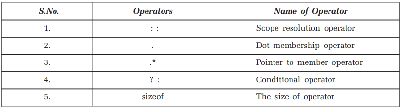

## Operator Overloading in C++
Operator overloading refers to overloading of one operator for many different purpose. For example, the binary + can be used to add two integer numbers, two float numbers, two structures variables, two union variables or two class objects.

- The use of operator overloading permits us to see no difference between built-in data types and user defined data types.
- It is one of the powerful and fascinating features of the C++ which give additional meaning to built-in standard operators like +, -, *, /,>, <, < =, > = etc.
~~~js
Syntax:
return-data-type operator symbol-of-operator (parameters)
    {
    //body of the function
    }
~~~
~~~js
Example:
void operator ++ ( )
    {
    body of function;
    }
~~~
- The word ‘operator’ is a keyword and is necessary for overloading an operator

## Rules for Operator Overloading

- Only the operators which are part of the C++ language can be overloaded. No new operator can be created using operator overloading.
- You can change the meaning of the operator i.e., a + operator can be overloaded to perform multiplication operation or > operator can be overloaded to perform addition operation. But you cannot change the priority of the operators.
- Any overloaded operator function must have at least one operand which is user defined type. All of the operands cannot be of basic types. If this is the case than function must be friend function of some class.
- In case of overloading binary operators left hand side operator must be an object of class when overloaded operator function is a member function of the class.
- Unary operators overloaded through member function of the class does not take any argument and overloaded through friend function must take one argument.
- There are certain operators which cannot be overloaded. They are:

- There are operators which cannot be overloaded using friend function. They are given as :

### Example-1: Write a C++ program to illustrate operator overloading, adding integer to object.
~~~js
//Write a C++ program to illustrate operator overloading, adding integer to object.
#include<iostream>
using namespace std;
class demo_op1
    {
    private :
    int num;
    public:
    void input( )
        {
        cout<<"Enter the number"<<endl;
        cin>> num;
        }
    void operator +(int x)
        {
        num=num+x;
        }
    void show( )
        {
        cout<<"The num is "<<num<<endl;
        }
    };
int main( )
    {
    demo_op1 d1;
    d1.input( );
    d1.show( );
    int x;
    cout<<"Enter the value you want to add\n";
    cin>>x;
    d1+x;
    d1.show( );
    }
~~~
~~~
Output:
Enter the number
20
The num is 20
Enter the value you want to add
20
The num is 40
~~~
### Example-2: Write a C++ program to illustrate operator overloading + with class object as argument.
~~~js
//Write a C++ program to illustrate operator overloading + with class object as argument.
#include<iostream>
using namespace std;
class demo_sum
    {
    private :
    int num;
    static int count;
    public :
    void input( )
        {
        cout<<"Enter the number for object"<<++count<<"\n";
        cin>>num;
        }
    int operator + (demo_sum temp)
        {
        return(num + temp.num);
        }
    void show( )
        {
        cout<<"The num is "<<num<<endl;
        }
    };
int demo_sum ::count;
int main( )
    {
    demo_sum d1, d2;
    d1.input( );
    d2.input( );
    d1.show( );
    d2.show( );
    int sum=d1+d2;
    cout<<"The sum of two object’s num is "<<sum<<endl;
    }
~~~
~~~
Output:
Enter the number for object1
100
Enter the number for object2
200
The num is 100
The num is 200
The sum of two objects num is 300
~~~
### Example-3: Write a C++ program to illustrate operator overloading +, -, *, AND / in the same program.
~~~js
//Write a C++ program to illustrate operator overloading +, -, *, AND / in the same program.
#include<iostream>
using namespace std;
class demo_exp
    {
    private :
    float num;
    static int count1, count2;
    public :
    void input( )
        {
        cout<<"Enter the number for object"<<++count1<<endl;
        cin>>num;
        }
    demo_exp operator *(demo_exp temp)
        {
        demo_exp t;
        t.num=num*temp.num;
        return t;
        }
    demo_exp operator +(demo_exp temp)
        {
        demo_exp t;
        t.num=num+temp.num;
        return t;
        }
    demo_exp operator -(demo_exp temp)
        {
        demo_exp t;
        t.num=num-temp.num;
        return t;
        }
    demo_exp operator /(demo_exp temp)
        {
        demo_exp t;
        if(temp.num)
            t.num=num/temp.num;
        else
            {
            cout<<"Division by zero is not allowed"<<endl;
            exit(0);
            }
        return t;
        }
    void show( )
        {
        cout<<"The sum for object"<<++count2<<"is "<<num<<endl;
        }
    };
int demo_exp :: count1;
int demo_exp :: count2;
int main( )
    {
    demo_exp d1,d2,d3,d4,d5;
    d1.input( );
    d2.input( );
    d3.input( );
    d4.input( );
    d1.show( );
    d2.show( );
    d3.show( );
    d4.show( );
    d5=d1+d2*d3/d1-d4;
    d5.show( );
    }
~~~
~~~
Output:
Enter the number for object1
10
Enter the number for object2
20
Enter the number for object3
30
Enter the number for object4
40
The sum for object1 is 10
The sum for object2 is 20
The sum for object3 is 30
The sum for object4 is 40
The sum for object5 is 30
~~~
## Example-4: Write a C++ program to illustrate operator overloading for > operator.
~~~js
//Write a C++ program to illustrate operator overloading for > operator.
#include<iostream>
using namespace std;
class emp
    {
    private :
    int sal;
    public :
    emp(int s)
        {
        sal=s;
        }
    void operator>(emp temp)
        {
        if(sal>temp.sal)
        cout<<"First employee’s salary is higher"<<endl;
        else
        cout<<"Second employee’s salary is highre"<<endl;
        }
    void show( )
        {
        cout<<"Salary is "<<sal<<endl;
        }
    };
int main( )
    {
    emp e1=emp(12545);
    emp e2=emp(13458);
    e1.show( );
    e2.show( );
    e1>e2;
    }
~~~
~~~
Output:
Salary is 12545
Salary is 13458
Second employees salary is higher
~~~
### Example-5: Write a C++ program to illustrate operator overloading for = operator.
~~~js
//Write a C++ program to illustrate operator overloading for = operator.
#include<iostream>
using namespace std;
class demo
    {
    int num;
    public :
    demo(int n)
        {
        num=n;
        }
    demo( ) {}
    void operator =(demo temp)
        {
        num=temp.num;
        cout<<"hello from ="<<endl;
        }
    void show( )
        {
        cout<<"num="<<num<<endl;
        }
    };
int main( )
    {
    demo d1(20);
    demo d2=d1;
    d1.show( );
    d2.show( );
    }
~~~
~~~
Output:
num=20
num=20
~~~
### Example-6: Write a C++ program to illustrate operator overloading for ++ unary operator.
~~~js
//Write a C++ program to illustrate operator overloading for ++ unary operator.
#include<iostream>
using namespace std;
class demo
    {
    int num;
    public :
    demo( ) {}
    demo (int x)
        {
        num=x;
        }
    demo operator++(int)
        {
        demo temp;
        temp.num=num;
        num++;
        return temp;
        }
    void show(char *s)
        {
        cout<<"num of object"<<s<<"="<<num<<endl;
        }
    };
int main( )
    {
    demo d1(20),d2;
    d2=d1++;
    d1.show ("d1");
    d2.show ("d2");
    }
~~~
~~~
Output:
num of objectd1=21
num of objectd2=20
~~~
### Example-7: Write a C++ program to illustrate operator overloading for pre ++ and post ++ unary operator in the same program.
~~~js
//Write a C++ program to illustrate operator overloading for pre ++ and post ++ unary operator in the same program.
#include<iostream>
using namespace std;
class demo
    {
    int num;
    public :
    demo( ) {} demo (int x)
        {
        num = x;
        }
    demo operator ++(int)
        {
        demo temp;
        temp.num = num;
        num++;
        return temp;
        }
    demo operator++( )
        {
        demo temp;
        num++;
        temp.num = num;
        return temp;
        }
    void show(char*s)
        {
        cout<<"NUM OF OBJECT"<<s<<" = "<<num<<endl;
        }
    };
int main( )
    {
    demo d1(30),d2,d3;
    d2=d1++;
    d3=++d1;
    d1.show("d1");
    d2.show("d2");
    d3.show("d3");
    }
~~~
~~~
Output:
NUM OF OBJECTd1 = 32
NUM OF OBJECTd2 = 30
NUM OF OBJECTd3 = 32
~~~
### Example-8: Write a C++ program to illustrate operator overloading – operator.
~~~js
//Write a C++ program to illustrate operator overloading - operator.
#include<iostream>
using namespace std;
class demo
    {
    int num;
    public :
    demo( ) {}
    demo(int x)
        {
        num=x;
        }
    demo operator -( )
        {
        demo temp;
        temp.num=-num;
        return temp;
        }
    void show(char *s)
        {
        cout<<" Num of object"<<s<<" ="<<num<<endl;
        }
    };
int main( )
    {
    demo d1(100),d2;
    d2=-d1;
    d1.show("d1");
    d2.show("d2");
    }
~~~
~~~
Output:
Num of objectd1 =100
Num of objectd2 =-100
~~~
### Example-9: Write a C++ program to illustrate operator overloading + operator.
~~~js
//Write a C++ program to illustrate operator overloading + operator.
#include<iostream>
using namespace std;
class demo
    {
    int num;
    public :
    demo(int x)
        {
        num=x;
        }
    void operator +( )
        {
        num=num>0 ?num :-num;
        }
    void show( )
        {
        cout<<"num = "<<num<<endl;
        }
    };
int main( )
    {
    demo d1(-100);
    cout<<"Before"<<endl;
    d1.show( );
    +d1;
    cout<<"After"<<endl;
    d1.show( );
    }
~~~
~~~
Output:
Before
num = -100
After
num = 100
~~~
### Example-10: Write a C++ program to illustrate operator overloading – operator using friend function.
~~~js
//Write a C++ program to illustrate operator overloading - operator using friend function.
#include<iostream>
using namespace std;
class demo
    {
    int num;
    public :
    demo( ) {}
    demo(int x)
        {
        num=x;
        }
    friend demo operator -(demo d)
        {
        demo temp;
        temp.num=-d.num;
        return temp;
        }
    void show(char *s)
        {
        cout<<"num of object "<<s<<" ="<<num<<endl;
        }
    };
int main( )
    {
    demo d1(100), d2;
    d2=-d1;
    d1.show("d1");
    d2.show("d2");
    }
~~~
~~~
Output:
num of object d1 =100
num of object d2 =-100
~~~
### Example-11: Write a C++ program to illustrate operator overloading >> and << operator using friend function.
~~~js
//Write a C++ program to illustrate operator overloading >> and << operator using friend function.
#include<iostream>
using namespace std;
class demo
    {
    int dx, dy;
    public :
    friend void operator <<(ostream &, demo &);
    friend void operator >>(istream &, demo &);
    };
void operator <<(ostream & mycout, demo & d)
    {
    mycout<<"dx = "<<d.dx<<"\t"<<"dy = "<<d.dy<<endl;
    }
void operator >>(istream & mycin, demo & d)
    {
    mycin>>d.dx>>d.dy;
    }
int main( )
    {
    demo d;
    cout<<"Enter the two numbers"<<endl;
    cin>>d;
    cout<<"You entered"<<endl;
    cout<<d;
    }
~~~
~~~
Output:
Enter the two numbers
20
30
You entered
dx = 20 dy = 30
~~~
