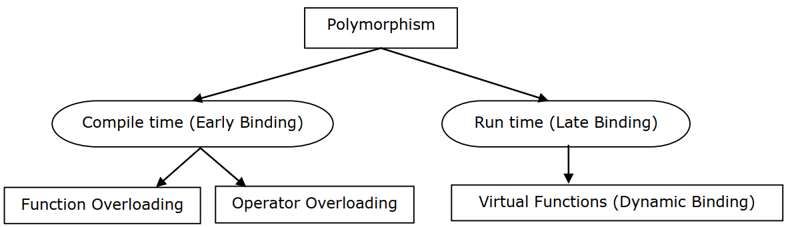
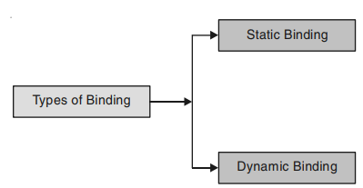

## Polymorphism in C++
Polymorphism is one of the crucial features of OOP. It simply means ‘one name, multiple forms’. Polymorphism means the ability to take more than one form.

- It allows a single name to be used for more than one related purpose.
- It means ability of operators and functions to act differently in different situations.
- Polymorphism is rendered possible by the fact that a pointer to a base class instance may also point to any subclass instance.
- Now let us consider a situation where the function name and prototype is the same in both the base and derived classes. For example, consider the following class definitions:
~~~js
class A
    {
    int x;
    public:
    void show() {....} // show() in base class
    };
class B: public A
    {
    int y;
    public:
    void show() {....} // show() in derived class
    };
~~~
- How do we use the member function show() to print the values of objects of both the classes A and B?
- Since the prototype of show() is the same in both the places, the function is not overloaded and therefore static binding does not apply.
- It would be nice if the appropriate member function could be selected while the program is running.
- This is known as run time polymorphism.
- How could it happen? C++ supports a mechanism known as virtual function to achieve run time polymorphism.
## Types of Polymorphisms
- Different types of polymorphism are

## Compile Time polymorphism
- Compile time polymorphism is function overloading and operator overloading.
## Function Overloading
- Function overloading is the practice of declaring the same function with different signatures. The same function name will be used with different number of parameters and parameters of different type. Overloading of functions with different return type is not allowed.
## Operator Overloading
- Operator overloading is the ability to tell the compiler how to perform a certain operation based on its corresponding operator’s data type. Like + performs addition of two integer numbers, concatenation of two string variables and works totally different when used with objects of time class.
## Dynamic Binding (Late Binding)
- Dynamic binding is the linking of a routine or object at runtime based on the conditions at that moment. It means that the code associated with a given procedure call is not known until the time of the call. At run-time, the code matching the object under current reference will be called.
## Virtual Function
- Virtual function is a member function of a class, whose functionality can be over-ridden in its derived classes.
- The whole function body can be replaced with a new set of implementation in the derived class. It is declared as virtual in the base class using the virtual keyword.

## Binding in C++
- Binding is the process of linking the function call with the place where the function definition is actually written. So that when a function call is made, it can be ascertained where the control has to be transferred. Binding is also termed as linking. Binding is of two types :

## Static Binding
- When it is known at compile time which function will be called in response to a function call, binding is known as static binding, compile time or early binding.
- Static binding is called so before program executes it is fixed that a particular function be called in response to a function call.
- Each time program executes same function will be called.
- As the linking is done early to the execution of the program executes same function will be called.
- As the linking is done at compile time it is known as compile time binding.
## Dynamic Binding
- When it is not certain that which function is called in response to a function call, binding is delayed till program executes.
- At run time the decision is taken as to which function is called in response to a function call.
- This type of binding is known as late binding, runtime binding or dynamic binding.
- Dynamic binding is based purely on finding the address of pointers and as addresses are generated during run time or when time run or when program executes, this type of binding is known as run-time or execution time binding.