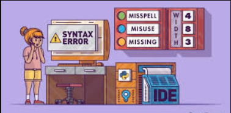
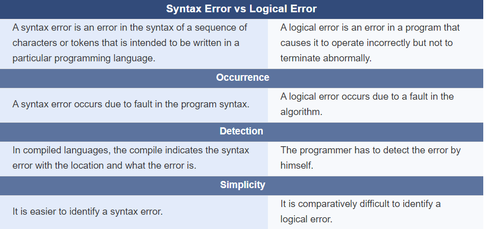

## Programming Error in C++

Errors might occur while programming. There are different types of errors. Programming errors can be categorized into three types are syntax errors, runtime errors, and logic errors. These errors are unavoidable, even for experienced programmers.Runtime error occurs at runtime.
- Some examples of runtime errors are diving by zero, accessing memory that is not available.
- Syntax errors occur due to syntax mistakes.
- The logical errors occur due to a fault in the logic of the program.
- The difference between a syntax error and logical error is that the syntax error occurs due to an error in the syntax of a sequence of characters or tokens that is intended to be written in a particular programming language while a logical error is an error that occurs due to the fault in the program.
## Syntax Errors
- Errors that are detected by the compiler are called syntax errors or compile errors.
- Syntax errors result from errors in code construction, such as mistyping a keyword, omitting necessary punctuation, or using an opening brace without a corresponding closing brace.
- These errors are usually easy to detect, because the compiler tells you where they are and what caused them. For example
~~~js
#include<iostream>
using namespace std
int main()
    {
    cout << "Programming is fun << endl;
    return 0;
    }
~~~
~~~
Output:
When you compile this program using Visual C++, it displays the following errors:
1>error C2144: syntax error : 'int' should be preceded by ';'
1>error C2001: newline in constant
1>error C2143:
~~~
- Three errors are reported, but the program actually has two errors. First, the semicolon (;) is missing at the end of line 2.
- Second, the string Programming is fun should be closed with a closing quotation mark in line 5.
- Since a single error will often display many lines of compile errors, it is a good practice to fix errors from the top line and work downward.
- Fixing errors that occur earlier in the program may also fix additional errors that occur later.

## Runtime Errors
- Runtime errors cause a program to terminate abnormally. They occur while an application is running if the environment detects an operation that is impossible to carry out.
- Input mistakes typically cause runtime errors.
- An input error occurs when the program is waiting for the user to enter a value, but the user enters a value that the program cannot handle.
- For instance, if the program expects to read in a number, but instead the user enters a string, this causes data-type errors to occur.
- Another common source of runtime errors is division by zero.
- This happens when the divisor is zero for integer divisions.
- For instance, the following program would cause a runtime error.
~~~js
#include<iostream>
using namespace std;
int main()
    {
    int i = 4;
    int j = 0;
    cout << i / j << endl;
    return 0;
    }
~~~
~~~
Error Explanation
Here, i and j are called variables.
i has a value of 4 and j has a value of 0.
i / j in line 7 causes a runtime error of division by zero syntax error : missing ';' before 'return'
~~~
## Logical Errors
- Logic errors occur when a program does not perform the way it was intended. Errors of this kind occur for many different reasons.
- For example, suppose you wrote the following program  to convert a Celsius 35 degree to a Fahrenheit degree-
~~~js
#include<iostream>
using namespace std;
int main()
    {
    cout << "Celsius 35 is Fahrenheit degree " << endl;
    cout << (9 / 5) * 35 + 32 << endl;
    return 0;
    }
~~~
~~~
Output:
Celsius 35 is Fahrenheit degree
67
This program will get Fahrenheit 67 degree, which is wrong.
It should be 95.
~~~
- In C++, the division for integers is the quotient.
- The fractional part is truncated. So 9 / 5 is 1.
- To get the correct result, we need to use 9.0 / 5, which results in 1.8.
## Important Note
- In general, syntax errors are easy to find and easy to correct, because the compiler indicates where the errors were introduced and why they are wrong.
- Runtime errors are not difficult to find, either, because the reasons and locations for the errors are displayed on the console when the program aborts.
- Finding logic errors, on the other hand, can be very challenging.
## Common Errors
- Missing a closing brace, missing a semicolon, missing quotation marks for strings, and misspelling names are common errors made by new programmers.
### Common Error 1: Missing Braces
- Braces are used to denote a block in the program. Each opening brace must be matched by a closing brace. A common error is missing the closing brace. To avoid this error, type a closing brace whenever an opening brace is typed.
### Common Error 2: Missing Semicolons
- Each statement ends with a statement terminator (;). Often, a new programmer forgets to place a statement terminator for the last statement in a block, as shown in the following example:
~~~js
int main()
    {
    cout << "Programming is fun!" << endl;
    cout << "Fundamentals First" << endl;
    cout << "Problem Driven" << endl  // missing semicolon
    }
~~~
## Common Error 3: Missing Quotation Marks
- A string must be placed inside the quotation marks. Often, a new programmer forgets to place a quotation mark at the end of a string.
### Common Error 4: Misspelling Names
- C++ is case-sensitive. Misspelling names is a common error made by new programmers. For example, the word main is misspelled as Main in the following code:
~~~js
int Main()
    {
    cout << (10.5 + 2 * 3) / (45 – 3.5) << endl;
    return 0;
    }
~~~
## Difference Between Syntax Error and Logical Error
