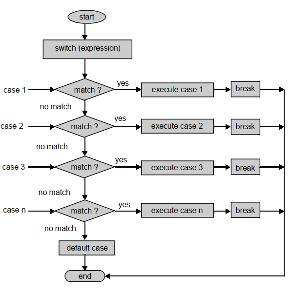

## Switch Statement in C++
When a multiple selection is desired we may use a if – else chain or switch statement. For large number of choices the if – else chain becomes unwieldy and confusing. A better method is the switch expression which is illustrated below.
~~~js
switch (expression)
{
    case value1 :
    statement1;
    break;
    case value2:
    statement2;
    break;
    case value3 :
    statement3;
    break;
    .................
    case valuen :
    statementn;
    break;
    default :
    statement;
}
~~~
- During execution of the program, the switch expression is evaluated. The expression should evaluate to an integer value.
- Its value is compared with the values mentioned in different cases mentioned under switch expression.
- If the value matches a value of a particular case, the
- statements in that case are carried out.
- If no case-value matches with the value of switch expression the program comes to the last statement which is a default statement.
- Provision of default statement is optional. It is useful in case of user interactive programs where the user may enter a wrong value by mistake.
- The statements contained in default case can remind the user that the data was wrong and prompt the user to enter correct data.
- After each case the statement break; is provided to get out of the switch at the end of a case which matched the key.
- If this is not provided, then all the statements following the match would also be carried out which is not desirable.
## Flow Diagram
The following figure illustrates the execution of switch statement.

## Important Note
- The following points must be taken care of while using switch statement.

- The (expression) must evaluate to an integral value.
- Characters may also be used in the switch expression because characters also have integer value as per ASCII code.
- The choices are enclosed between a pair of curly brackets.
- Each case value is followed by colon ( : ).
- All the statements following a match are carried out. After the colon there may be one or more than one statements. In case of multiple statements there is no need to put them between curly braces.
- The break statement should be given at end of every case, otherwise, all the cases following a match would be carried out.
### Example-1: Write a C++ program to illustrate switch statement for finding the day.
~~~js
//Write a C++ program to illustrate switch statement for finding the day.
#include<iostream>
using namespace std;
main()
{
    int m ;
    cout<<“Name the day which is day number ”;
    cin>>m ;
    switch (m)
    {
        case 1:
        cout<<“It is Monday”<< endl; break ;
        case 2:
        cout<<“It is Tuesday”<< endl; break;
        case 3:
        cout<<“It is Wednesday” <<endl; break;
        case 4:
        cout<<“It is Thursday” <<endl; break;
        case 5:
        cout<<“It is Friday”<< endl; break;
        case 6:
        cout<<“It is Saturday”<<endl; break ;
        case 7:
        cout<<“It is Sunday”<<endl; break ;
        default:
        cout <<“The number entered is not in the range.”<<endl;
    }
    return 0;
    }
~~~
~~~
Output:
Name the day which is day number 4
It is Thursday
~~~
### Example-2: Write a C++ program to illustrate switch statement to check the candidate eligible or not for admission.
~~~js
//Write a C++ program to illustrate switch statement to check the candidate eligible or not for admission.
#include<iostream>
using namespace std;
int main()
{
    int Marks;
    cout << “Enter your percent marks ”;
    cin >> Marks ;
    switch ( Marks/15)
    {
        case 6:
        cout<<“You can get admission in all branches”<<endl;
        cout<< “Finish the admission formalities by week end”<<endl;
        break;
        case 5 :
        cout<<“You can get admission in all branches except the science courses.”<<endl;
        cout<< “Finish admission formalities before month end.”<<endl;
        break ;
        case 4:
        cout <<“You are not eligible for Science and economics.”<<endl;
        cout<< “Choose other courses by tomorrow.”<<endl;
        break;
        case 3:
        cout<<“You are eligible for English and Hindi courses only.”<< endl;
        cout<<“Complete admission formalities soon.”<<endl;
        break ;
        case 2:
        cout<<“Sorry, Not eligible here.”<<endl;
        cout<< “Better try correspondence courses.”<<endl; break;
        default: cout << “Sorry, Marks entered are not correct” <<endl; }
        return 0;
    }
~~~
~~~
Output:
Enter your percent marks 63
You are not eligible for Science and economics.
Choose other courses by tomorrow.
~~~