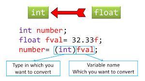
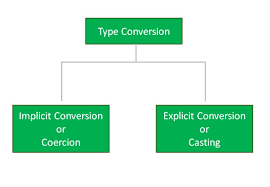

## Type Casting in C++
Type casting operators allow you to convert a datum of a given type to another. There are several ways to do this in C++.

- C++ is a strong-typed language, which mean have associated data type with a variable before it is being used in program.
- Conversion of an expression of a given type into another type is called as type casting.
- Type Casting is a mechanism which enables a variable of one datatype to be converted to another datatype.
- When a variable is typecast into a different type, the compiler basically treats the variable as of the new data type.
- There are two types of type conversion:

## Implicit Type Conversion

- Whenever data types are mixed in an expression, C++ performs the conversions automatically.
- This process is known as implicit or automatic conversion.
~~~
Example: m= 5+2.5
~~~
- For a binary operator, if the operands type differs, the compiler converts one of them to match with the other.
- Using the rule that the smaller type is converted to wider type.
- For example if one operand is integer and another is float then integer is converted to float because float is wider than integer.
- In above example answer means m, will be in float.

## Explicit Type conversion
- C++ permits explicit type conversion of variables or expressions using the type cast operator.
~~~
Syntax: type_name (expression)
Example: average = sum/float(i);
~~~
- Alternatively we can use typedef to create an identifier of the required type and use it in the functional notation. Example:
~~~
typedef int * int_ptr;p = int_ptr(q);
~~~
### Example-1: Write a C ++ program to implement casting.
~~~js
//Write a C ++ program to implement casting.
#include<iostream>
using namespace std;
int main()
        {
        int intvar=5;
        float floatvar=3.5;
        cout<<"intvar = "<<intvar;
        cout<<"\nfloatvar = "<<floatvar;
        cout<<"\nfloat(intvar) = "<<float(intvar);
        cout<<"\nint(floatvar) = "<<int(floatvar);
        }
~~~
~~~
Output:
intvar = 5
floatvar = 3.5
float(intvar) = 5
int(floatvar) = 3
~~~
### Example-2: Write a C++ program to implement implicit type conversion.
~~~js
// Write a C++ program to implement implicit type conversion.
#include<iostream>
using namespace std;
int main()
        {
        int x = 100; // integer x
        char y = 'd'; // character c
        // y implicitly converted to int. ASCII value of 'a' is 97
        x = x + y; // x is implicitly converted to float
        float z = x + 5.0;
        cout << "x = " << x << endl << "y = " << y << endl << "z = " << z << endl;
        return 0;
        }
~~~
~~~
Output:
x = 200
y = d
z = 205
~~~
### Example-3: Write a C++ program to demonstrate explicit type casting
~~~js
// Write a C++ program to demonstrate explicit type casting
#include<iostream>
using namespace std;
int main()
        {
        double x = 100.2;
        // Explicit conversion from double to int
        int sum = (int)x + 100;
        cout << "Sum = " << sum;
        return 0;
        }
~~~
~~~
Output:
Sum = 200
~~~