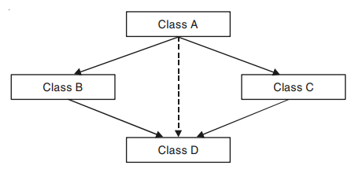

## Virtual Class in C++
Virtual classes are primarily used during multiple inheritance. To avoid, multiple instances of the same class being taken to the same class which later causes ambiguity, virtual classes are used.

- An ambiguity can arise when several paths exist to a class from the same base class.
- This means that a child class could have duplicate sets of members inherited from a single base class.
- C++ solves this issue by introducing a virtual base class.
- When a class is made virtual, necessary care is taken so that the duplication is avoided regardless of the number of paths that exist to the child class.
- Consider the situation where we have one class A. This class A is inherited by two other classes B and C.
- Both these classes are inherited in a new class D. This is as shown in figure given below. In dummy code form this is shown below :
~~~js
class A
{
};
class B :public A
{
};

class C : public A{
};
class D :public C, public B
{
};
~~~

- Class A are inherited twice to class D. One through class B and second through class C.
- When any data/ function members of class A is accessed by an object of class D, ambiguity arises as to which data/function members would be called ?
- One inherited through B or the other inherited through C.
- This confuses compiler and it flashes error message.
- To resolve this ambiguity when class A is inherited in both class B and class C, it is declared as virtual base class by placing the keyword virtual.
### Example-1: Write a C++ program to illustrate virtual function.
~~~js
//Write a C++ program to illustrate virtual function.
#include <iostream>
using namespace std;
class A
    {
    public :
    int a;
    A( )
        {
        a=100;
        }
    };
class B :public virtual A
    {
    };
class C :virtual public A
    {
    };
class D : public B, public C
    {
    };

int main( )
    {

    cout<<" a="<<(new D)->a<<endl;
    }
~~~
~~~
Output:
a=100;
~~~

### Example-2: Write a C++ program to illustrate another example virtual function.
~~~js
//Write a C++ program to illustrate another example virtual function.
#include <iostream>
using namespace std;
class A
    {
    public :
    void show( )
        {
        cout<<"hello from show of A"<<endl;
        }
    };
class B :public virtual A
    {
    };
class C :virtual public A
    {
    };
class D : public B, public C
    {
    };

int main( )
    {
    D obj;
    obj.show( );
    }
~~~
~~~
Output:
hello from show of A
~~~
