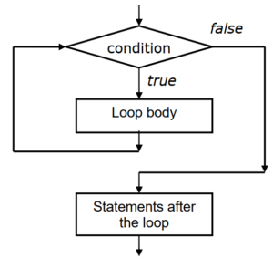

## While Loop in C++
Many times it is necessary to execute several statements repetitively for certain number of times. In such cases, we can use looping statements of C++ programming language. The statements are executed until a condition given is satisfied. Depending upon the position of the condition in the loop, the loop control structures are classified as the entry-controlled loop and exit-controlled loop. They are also called as pre-test and post-test loops respectively.

## While Loop Statement
The ‘while’ is an entry-controlled loop statement having following general form:
~~~js
while(condition)
    {
    //loop statements or body of loop
    }
~~~
- Here, the condition is evaluated first, if it is true then loop statements or body of the loop is executed.
- After this the program control will transfer to condition again to check whether it is true or false.
- If true, again loop body is executed.
- This process will be continued until the condition becomes false.
- When is becomes false, the statements after the loop are executed.
- This is also called as pre-test loop.
## Flow Diagram
- The flow diagram of while loop statement is given below-

### Example-1: Write a C++ program to Illustrates while loop for determining sum of numbers from 1 to 10.
~~~js
// Write a C++ program to Illustrates while loop for determining sum of numbers from 1 to 10.
#include<iostream>
using namespace std ;
int main()
    {
    int n = 10, i= 0, Sum = 0;
    while (i <= n)
    Sum += i++;
    cout << “Sum of integers from 1 to 10 = ” << Sum
    }
~~~
~~~
Output:
Sum of integers from 1 to 10 = 55
~~~
### Example-2: Write a C++ program to  Illustrates while loop for determining square roots of numbers.
~~~js
//Write a C++ program to  Illustrates while loop for determining square roots of numbers.
#include<iostream>
#include<cmath>   /*Header file cmath required for square root.*/
using namespace std;
int main()
    {
    int n = 10,N ,i=0;
    while( i<5 ) // Note that there is no semi-colon at the end.
    {
    N = i*n;
    cout <<“Number = “ << N <<“\tSquare root = “<<sqrt(N)<<endl;
    i++;
    }
    return 0;
    }
~~~
~~~
Output:
Number = 0 Square root = 0
Number = 10 Square root = 3.16228
Number = 20 Square root = 4.47214
Number = 30 Square root = 5.47723
Number = 40 Square root = 6.32456
~~~
### Example-3: Write a C++ program to  illustrates nested while loops.
~~~js
// Write a C++ program to  illustrates nested while loops.
#include<iostream>
using namespace std;
void main()
    {
    int x =0,i=0 ;
    cout<<“i\tj\tx\ty” <<endl;
    while (i<=2)
        {
            int j = 0; // outer while loop
            while (j<=2)
                {
                x+=(i+j); // inner while loop
                int y = x*x;
                cout <<i<<“\t”<<j<<“\t”<<j=j+1;
                }
            i =i+1;
        }
    }
~~~
~~~
Output:
i j x y
0 0 0 0
0 1 1 1
0 2 3 9
1 0 4 16
1 1 6 36
1 2 9 81
~~~
### Example-4: Write a C++ program to  illustrates compound condition in while (expression).
~~~js
// Write a C++ program to  illustrates compound condition in while (expression).
#include<iostream>
using namespace std;
int main()
    {
    int x =0,i=2,y;
    cout<<“\ti \tx \ty” <<endl;
    while ( i>=2,i<=4 ) // compound while expression
        {
        x = 2*i;
        y = x*x;
        cout <<i<< “\t”<     i =i+1;
        }
    return 0;
    }
~~~
~~~
Output:
i x y
2 4 16
3 6 36
4 8 64
~~~

### Example-5: Write a C++ program to  illustrates compound condition in while (expression).
~~~js
//Write a C++ program to  illustrates compound condition in while (expression).
#include<iostream>
using namespace std;
int main()
    {
    int x =0,i=2,j=0,k = 0,y;
    cout<<“i\tj\tk\tx\ty” <<endl;
    while (i>=2, i<=4,j<=5 ,k <=6 ) // compound while condition
        {
            x =(i+j+k);
            y = x*x;
            cout <<i<<“\t”<<j<<“\t” <     j++;
            i ++;
            k ++;
        }
    return 0;
    }
~~~
~~~
Output:
i j k x y
2 0 0 2 4
3 1 1 5 25
4 2 2 8 64
5 3 3 11 121
6 4 4 14 196
7 5 5 17 289
8 6 6 20 400
~~~
### Example-6: Write a C++ program to illustrates while loop with compound Boolean expression.
~~~js
//Write a C++ program to illustrates while loop with compound Boolean expression.
#include<iostream>
using namespace std;
int main()
    {
    int x =0,i=3,j=0,y;
    cout<<“\ti\tj\tx\ty” <<endl;
    while (j< 5 && i>=3 && i<= 10)
        {
            x+=(i+j);
            y = x*x;
            cout <<“\t”<<i<<“\t”<<j<<“\t”<     j++;
            i++;
        }
return 0;
}
~~~
~~~
Output:
i j x y
3 0 3 9
4 1 8 64
5 2 15 225
6 3 24 576
7 4 35 1225
~~~