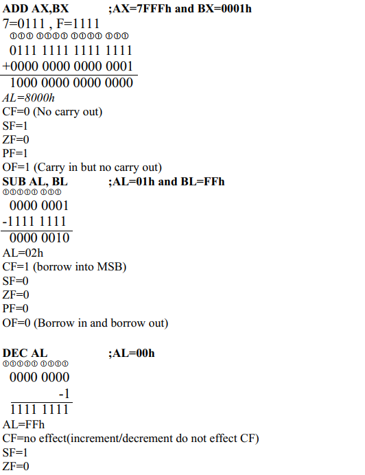
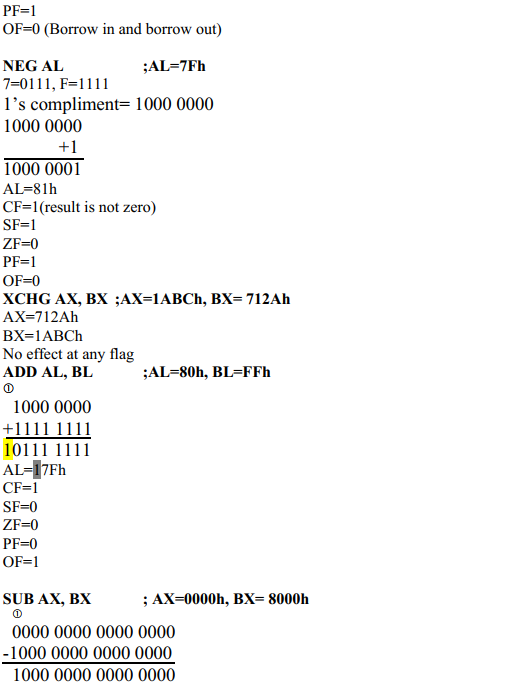
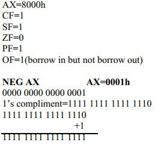
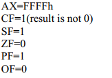
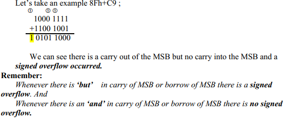
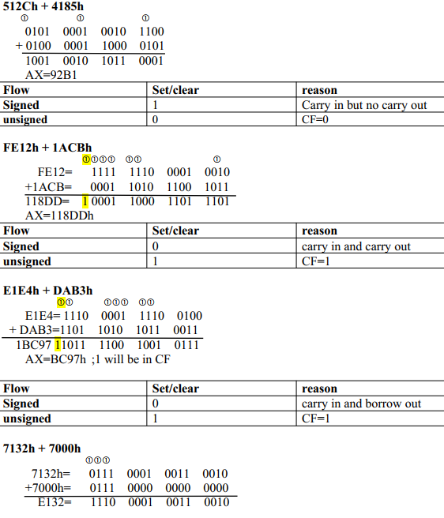
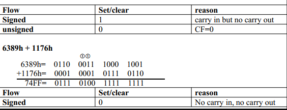
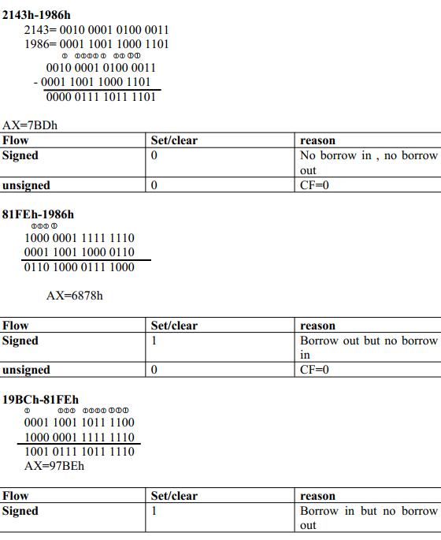
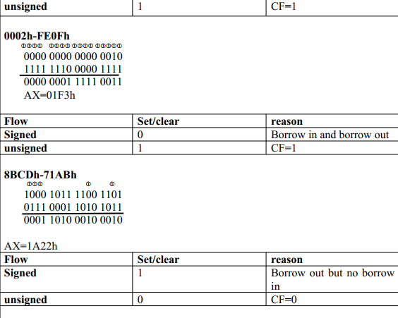

## Assembly Language Program Exercise
### Question1:
#### For each of the following instructions, give the new destination contents and the new settings of CF,SF,ZF,PF and OF. Suppose that the flags are initially 0 in each part of this question.
#### A) ADD AX,BX ;AX=7FFFh and BX=0001h
#### B) SUB AL, BL ;AL=01h and BL=FFh
#### C) DEC AL ;AL=00h
#### D) NEG AL ;AL=7Fh
#### E) XCHG AX, BX ;AX=1ABCh, BX= 712Ah
#### F) ADD AL, BL ;AL=80h, BL=FFh
#### G) SUB AX, BX ; AX=0000h, BX= 8000h
#### H) NEG AX AX=0001h

### Question 2:
### a) Suppose that AX and BX both contains +ive numbers, and ADD AX, BX is executed , show that there is carry into the MSB but no carry out of the MSB if and only if, signed overflow occurs.
### Solution:
As we know signed overflow occurs if and if:
- There is a carry into the MSB but no carry out of the MSB.(for addition)
- There is a carry out of the MSB but no carry into the MSB.(for addition)
- There is a borrow into the MSB but no borrow into the MSB.(for subtraction)
- There is a borrow out of the MSB but no borrow into the MSB.(for subtraction)
- So; For the proof you can see question 3 part a and d. Here signed flow is occurred because of a carry into the MSB but no carry out of the MSB. Also in part e where there is no carry out and no carry in; no signed overflow occurred.

### b) Suppose that AX and BX both contains -ive numbers, and ADD AX, BX is executed , show that there is carry out of the MSB but no carry into the MSB if and only if, signed overflow occurs.

### Question 3:
#### Suppose ADD AX,BX is executed. In each of the following parts, the first number being added is the content of AX, and the second number is the contents of BX. Give the resulting value of AX and tell whether signed or unsigned overflow occurred.
#### a) 512Ch + 4185h
#### b) FE12h + 1ACBh
#### c) E1E4h + DAB3hd)
#### d) 7132h + 7000h
#### e) 6389h + 1176h

### Question 4:
#### Suppose SUB AX,BX is executed. In each of the following parts, the first number being added is the content of AX, and the second number is the contents of BX. Give the resulting value of AX and tell whether signed or unsigned overflow occurred.
#### a) 2143h-1986h
#### b) 81FEh-1986h
#### c) 19BCh-81FEh
#### d) 0002h-FE0Fh
#### e) 8BCDh-71ABh

