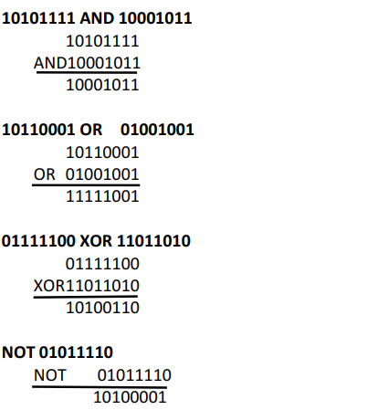
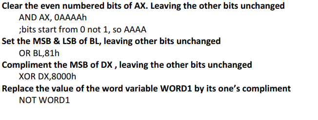
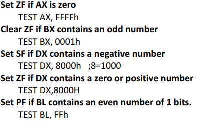
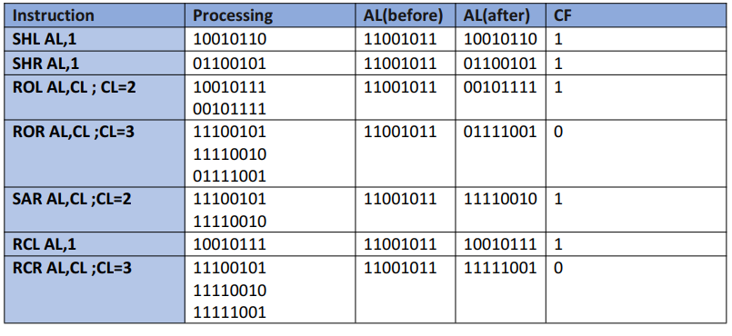
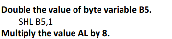
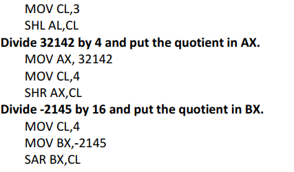

## Assembly Language Program Exercise
Question 1: Perform the following logic operations:
#### A) 10101111 AND 10001011
#### B) 10110001 OR 01001001
#### C) 01111100 XOR 11011010
#### D) NOT 01011110

### Question 2: Give a logic instruction to do each of the following
#### A) Clear the even numbered bits of AX. Leaving the other bits unchanged
#### B) Set the MSB & LSB of BL, leaving other bits unchanged
#### C) Compliment the MSB of DX , leaving the other bits unchanged
#### D) Replace the value of the word variable WORD1 by its one’s compliment

### Question 3: use the test instruction to do each of the following.
#### A. Set ZF if AX is zero
#### B. Clear ZF if BX contains an odd number
#### C. Set SF if DX contains a negative number
#### D. Set ZF if DX contains a zero or positive number
#### E. Set PF if BL contains an even number of 1 bits.

### Question 4: Suppose AL contains 11001011b and CF=1. give the new contents of AL after each of the following instruction is executed. Assume the preceding initial conditions for each part of this question.
#### a. SHL AL,1
#### b. SHR AL,1
#### c. ROL AL,CL ; CL=2
#### d. ROR AL,CL ;CL=3
#### e. SAR AL,CL ;CL=2
#### f. RCL AL,1
#### g. RCR AL,CL ;CL=3

### Question 5: Write instructions to do each of the following. Assume that no overflow occurred.
#### a) Double the value of byte variable B5.
#### b) Multiply the value AL by 8.
#### c) Divide 32142 by 4 and put the quotient in AX.
#### d) Divide -2145 by 16 and put the quotient in BX.

