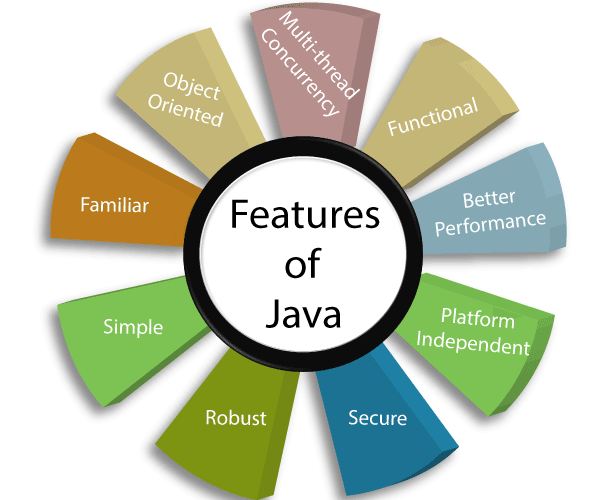

## Introduction to Java Programming Language
Java is a general-purpose, object-oriented programming language developed by Sun Microsystems of USA in 1991. Originally called Oak by James Gosling, one of the inventors of the language. Java was designed for the development of software for consumer electronic devices like TVs, VCRs, toasters and such other electronic machines.

The goal had a strong impact on the development team to make the language simple, portable and highly reliable. The Java team which included Patrick Naughton discovered that the existing languages like C and C++ had limitations in terms of both reliability and portability. However, they modelled their new language Java on C and C’*+ but removed a number of features of C and C++ that were considered as sources of problems and thus made Java a really simple, reliable, portable, and powerful language.

## History of Java
There is a chronicle of events that occurred during the whole course of development of the Java language.
- 1990-A team of Sun Microsystems programmers decided to develop a special software to manipulate consumer electronic devices. The team headed by James Gosling
- 1991-The team studied various languages present at that time, viz., C and C++ and announced the new language to be “Oak”.
- 1992-The team at Sun known as Green Project demonstrated the application of their new language. For example, to control a list of home appliances using a hand device with the tiny touchscreen.
- 1993-The World Wide Web came to the internet and transformed the text-based Internet into the graphical rich environment. The Green Project team came up with an idea of developing Web applets (tiny programs) that could run on all types of computers connected to the internet.
- 1994-The team developed a web browser called “HotJava” to locate and run applet programs on the internet. This made it immensely popular amongst the internet users.
- 1995-Oak was renamed as “Java”, due to some legal snags. Java is a name, no acronym.
- 1996-Java programming was established as the leader for internet programming and also as a general-purpose object-oriented programming language. Sun releases Java Development Kit 1.0.
- 1997-Sun releases Java Development Kit 1.1 (JDK 1.1)
- 1998-Sun releases the Java 2 with version 1.2 of the Software Development Kit (SD K 1.2)
- 1999-Sun releases Java 2 platform, Standard Edition (J2SE) and Enterprise Edition (J2EE)
- 2000-Release ofJ2SE with SDK 1.3.
- 2002-The release of J2SE with SDK 1.4.
- 2004-The release of J2SE with JDK 5.0 (instead of JDK 1.5), known as J2SE 5.0.
- 2006- The release of Java SE 6.
- 2011- The release of Java SE 7.
- 2014- The release of Java SE 8.
- 2017- The release of Java SE 9.

## Feature of Java
Sun Microsystems officially describes Java with the following attributes:
- Compiled and Interpreted
- Platform-Independent and Portable ( Architecture Neutral )
- Object-Oriented
- Robust and Secure
- Distributed
- Familiar, Simple and Small
- Multithreaded
- Interactive
- High Performance
- Dynamic
- Extensible

These features have made Java the first application language of the World Wide Web. Java will also become the premier language for general purpose stand-alone applications.

### Compiled And Interpreted
- Usually a computer language is either compiled., or interpreted. Java combines both these approaches thus making Java a two-stage system.
- First, Java compiler translates source code into what is known as byte code instructions. Byte codes are not machine instructions
- In the second stage, Java interpreter generates machine code that can be directly executed by the machine that is running the Java program.
- We can thus say that Java is both a compiled and an interpreted language.

### Platform-Independent And Portable
- The most significant contribution of Java over other languages is its portability.
- Java programs can be easily moved from one computer system to another, anywhere and anytime.
- If there are changes and upgrades in operating systems, processors and system resources there is no need to do any changes in Java programs.
- Java ensures portability in two ways.
- First, Java compiler generates byte code instructions that can be implemented on any machine.
- Secondly, the size of the primitive data types is machine independent.

### Object-Oriented
- Java is a true object-oriented language.
- Almost everything in Java is an object. All program code and data reside within objects and classes.
- Java comes with an extensive set of classes, arranged in packages, that we can use in our programs by inheritance.
- The object model in Java is simple and easy to extend.

### Robust And Secure
- Most programs in use today fail for one of the two reasons Memory management or Exceptional conditions.
- Thus, the ability to create robust programs was given a high priority in the design of Java.
- Java forces the user to find mistakes in the early stages of program development. At the same time, Java frees the user from having to worry about many of the most common causes of programming errors.
- Java checks code at compilation time. However, it also checks the code at run time.

### Distributed
- Java is designed as a distributed language for creating applications on networks.
- It has the ability to share both data and programs. Java applications can open and access remote objects on Internet as easily as they can do in a local system.
- This enables multiple programmers at multiple remote locations to collaborate and work together on a single project.

### Simple, Small and Familiar
- Java is a small and simple language. Java does not support many features of C and C+ + that are either redundant or sources of unreliable code.
- For example, Java does not use pointers, preprocessor header files, goto statement and many others. It also eliminates operator overloading and multiple inheritance.
- Familiarity is another striking feature of Java. To make the language look familiar to the existing programmers, it was modelled on C and C+ + languages.
- Java uses many constructs of C and C+ + and therefore, Java code “looks like a C++” code. In fact, Java is a simplified version of C++.

### Multithreaded Interactive
- Multithreaded means handling multiple tasks simultaneously.
- Java supports multithreaded programs. This means that we need not wait for the application to finish one task before beginning another.
- The Java runtime supports multiprocessor synchronization and constructs smoothly running interactive systems.

### High Performance
- Java is good as an interpreted language, mainly due to the use of intermediate bytecode.
- According to Sun Microsystems, Java speed is comparable to the native C/C++.

### Dynamic and Extensible
- Java is a dynamic language.
- Java is capable of dynamically linking in new class libraries, methods, and objects.
- Java can also determine the type of class through a query, making it possible to either dynamically link or abort the program, depending on the response.

## Application of Java
Java is one of the popular programming languages having large number of applications.

### Mobile Applications
- Java is considered as the official programming language for mobile app development. It is compatible with software such as Android Studio and Kotlin.
### Desktop GUI Applications
- All desktop applications can easily be developed in Java. Java also provides GUI development capability through various means mainly Abstract Windowing Toolkit (AWT), Swing, and JavaFX.
### Web-based Applications
- Java is also used to develop web applications. It provides vast support for web applications through Servlets, Struts, or JSPs. With the help of these technologies, you can develop any kind of web application that you require.
### Enterprise Applications
- Java is the first choice of many software developers for writing applications and Java Enterprise Edition (Java EE) is a very popular platform that provides API and runtime environment for scripting. It also includes network applications and web-services.
### Scientific Applications
- Sofware developers see Java is the weapon of choice when it comes to coding the scientific calculations and mathematical operations. These programs are designed to be highly secure and lighting fast.
### Gaming Applications
- Java has the support of the open-source most powerful 3D-Engine, the jMonkeyEngine that has the unparalleled capability when it comes to the designing of 3D games.
### Big Data technologies
- Java is the reason why the leading Big Data technologies like Hadoop have become a reality and also the most powerful programming languages like Scala are existing.
### Business Applications
- Java EE platform is designed to help developers create large-scale, multi-tiered, scalable, reliable, and secure network applications. These applications are designed to solve the problems encountered by large enterprises.
### Distributed Applications
- Distributed applications have several common requirements that arise specifically because of their distributed nature and of the dynamic nature of the system and platforms they operate on. Java offers options to realize these applications
### Cloud-based Applications
- Cloud computing means on-demand delivery of IT resources via the internet with pay-as-you-go pricing. It provides a solution for IT infrastructure at a low cost.