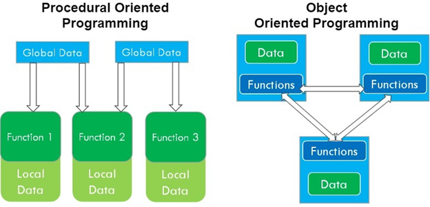

## Object Oriented Programming (OOP) Languages in Java
Object oriented programming (OOP) is an approach that provides a way of modularizing programs by creating partitioned memory area for both data and functions that can be used as templates for creating copies of such modules on demand. This means that an object is considered to be a partitioned area of computer memory partitions are independent, the objects can be used in a variety of different programs without modifications.

   - One of the principal advantages of object-oriented programming (OOP) techniques over procedural oriented programming (POP) techniques is that they enable programmers to create modules that do not need to be changed when a new type of object is added.
   - A programmer can simply create a new object that inherits many of its features from existing objects.
   - This makes object oriented programs easier to modify. OOP treats data as a critical element in the program development and does not allow it to flow freely around the system.
   - It ties data more closely to the functions that operate on it and protects it from unintentional modification by other functions.
   - OOP allows us to decompose a problem into a number of entities called Objects and then build data and functions(Known as methods in Java) around these entities.

## Difference between OOP and POP
   - In POP, importance is given to the sequence of things to be done i.e. algorithms and in OOP, importance is given to the data.
   - In POP, larger programs are divided into functions and in OOP, larger programs are divided into objects.
   - In POP, most functions share global data i.e data move freely around the system from function to function. In OOP mostly the data is private and only functions inside the object can access the data.
   - POP follows a top down approach in problem solving while OOP follows a bottom up approach.
   - In POP, adding of data and function is difficult and in OOP it is easy.
   - In POP, there is no access specifiers and in OOP there are public, private and protected specifiers.
   - In POP, operator cannot be overloaded and in OOP operator can be overloaded.
   - In POP, Data moves openly around the system from function to function, In OOP objects communicate with each other through member functions

## Benefits of OOPS
   - It eliminates the redundancy.
   - Higher productivity and time saving.
   - It provides great security.
   - Multiple instance.
   - Sharing projects.
   - Data centered design.
   - Easy up gradations from small to large.
   - Communication is simple.
   - Complexity is manageable.

## Applications of OOPS
1. The most popular application has being in the area of user interface design such as window, real business system are given more complex and contain many more object with complicated attributes. OOPS is useful in this type of applications.
2. These are different areas of OOPS if real time systems, simulations and modeling, object oriented databases application that are artificial intelligence and expert systems, neural network and parallel processing systems.
3. The object oriented language has gained importance in design and has recently moved into analysis.
   - Real-time systems.
   - Simulation and modeling
   - Object oriented databases
   - Hypertext, hypermedia and expertext
   - AI and expert systems
   - Neural network and parallel programming
   - Decision support and office automation systems
   - CIM/CAD/CAM systems. - Cloud computing means on-demand delivery of IT resources via the internet with pay-as-you-go pricing. It provides a solution for IT infrastructure at a low cost.