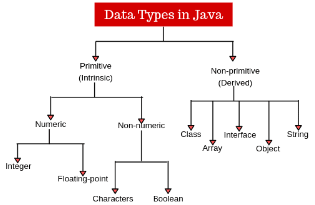
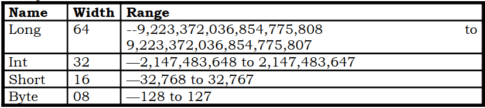
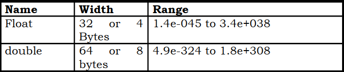

## Data Types in Java
Data type specifies the size and type of values that can be stored in an identifier. The Java language is rich in its data types. Different data types allow you to select the type appropriate to the needs of the application. Data types in Java are classified into two types:

1. Primitive—which include Integer, Character, Boolean, and Floating Point.
2. Non-primitive—which include Classes, Interfaces, and Arrays.

## Integer Data Type
Java defines four integer types: byte, short, int, and long. All are signed, positive and negative values. Java does not support unsigned, positive-only integers.

## Byte
- The smallest integer type is byte. This is a signed 8-bit type that has a range from -128 to 127.
- Variables of type byte are useful while working with a stream of data from a network or file. They are also useful while working with raw binary data that may not be directly compatible with Java’s other built-in types.
- Byte variables are declared by use of the byte keyword. Example byte ,a
## Short
- Short is a signed 16-bit type.
- With the range from —32,768 to 32,767.
- This type is mostly applicable to 16-bit computers, which are becoming increasingly scarce. Example short num , sum ;

## Int
- The most commonly used integer type is int.
- It is a signed 32-bit type that has a range from —2,147,483,648 to 2,147,483,647.
- Variables of type int are commonly employed to control loops and to index arrays.
- The int type is the most versatile and efficient type, and it should be used most of the time when you want to create a number for counting or indexing arrays or doing integer math.

## Long
- Long is a signed 64-bit type and is useful for those occasions where an int type is not large enough to hold the value.
- The range of a long is quite large.
- Used in the program that computes the number of miles that light will travel in a specified number of days.

## Floating Point Data Type
Floating-point numbers, also known as real numbers, are used when evaluating expressions that require fractional precision.

- For example, calculations such as square root, or transcendental such as sine and cosine, result in a value whose precision requires a floating-point type.
- There are two kinds of floating-point types, float and double, which represent single- and double-precision numbers, respectively.
- The float specifies a single-precision value that uses 32 bits of storage.
- Double precision, as denoted by the double keyword, uses 64 bits to store a value.
## Character Data Type
In Java char data type is used to store characters. It is not similar to one in C/C++ In C/C++, char is an integer type that is 8 bits wide. But this not the case in Java.

- Since Java uses Unicode to represent characters.
- Unicode defines a fully international character set that can represent all of the characters found in all human languages.
- Thus, in Java char is a 16-bit type.
- The range of a char is 0 to 65,536. There are no negative chars.
- The standard set of characters known as ASCII still ranges from 0 to 127 as always, and the extended 8-bit character set.
## Boolean data Type
Simplest data in type, is boolean, for logical values. It can take one of two possible values, true or false.
- Such conditions are returned by all relational operators, such as a <b.
- Boolean is also the type required by the conditional expressions that govern the control statements such as if and for.