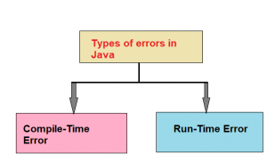

## Exception Handling in Java
Exception handling is one of the most important feature of java programming that allows us to handle the runtime errors caused by exceptions. It  is an abnormal condition. An exception is a condition that is caused by a run-time error in the program. When the Java interpreter encounters an error such as dividing an integer by zero, it creates an exception object and throws it(i.e., informs us that an error has occurred). If the exception object is not caught and handled properly, the interpreter will display an error message and will terminate the program.

- For example, look at the system generated exception below:
~~~
Exception in thread "main" java.lang.ArithmeticException: / by zero at
ExceptionDemo.main(ExceptionDemo.java:5)
ExceptionDemo : The class name
main : The method nameExce
ptionDemo.java : The filenamejava:5 : Line number
~~~
- This message is not user friendly so a user will not be able to understand what went wrong.
- In order to let them know the reason in simple language, we handle exceptions.
- If we want the program to continue with the execution of the remaining code, then we should try to catch the exception object thrown by the error condition and then display an appropriate message for taking corrective actions.
- This task is known as exception handling.

## Exception
- An Exception is an unwanted event that interrupts the normal flow of the program.
- When an exception occurs program execution gets terminated.
- In such cases we get a system generated error message.
- The good thing about exceptions is that they can be handled in Java.
- By handling the exceptions, we can provide a meaningful message to the user about the issue rather than a system generated message, which may not be understandable to a user.
- There can be several reasons that can cause a program to throw exception. For example: Opening a non-existing file in your program, Network connection problem, bad input data provided by user etc.
## Advantage of Exception Handling
- Exception handling ensures that the flow of the program doesn’t break when an exception occurs.
- For example, if a program has bunch of statements and an exception occurs mid way after executing certain statements then the statements after the exception will not execute and the program will terminate abruptly.
- By handling we make sure that all the statements execute and the flow of program doesn’t break.

## Types of Error
- Errors may broadly be classified into two categories:
   - Compile-time errors
   - Run-time errors

## Compile-Time Errors
- All syntax errors will be detected and displayed by the Java compiler and therefore these errors are known as compile-time errors. Whenever the compiler displays an error, it will not create the .class file. It is therefore necessary that we fix all the errors before we can successfully compile and run the program.
- Most of the compile-time errors are due to typing mistakes.
- Typographical errors are hard to find. We may have to check the code word by word, or even character by character.
- The most common problems are:
- Missing semicolons
- Missing (or mismatch of) brackets in classes and methods
- Misspelling of identifiers and keywords
- Missing double quotes in strings
- Use of undeclared variables
- Incompatible types in assignments / initialization
- Bad references to objects
- Use of = in place of = = operator

## Run-Time Errors
- Sometimes, a program may compile successfully creating the .class file but may not run properly. Such programs may produce wrong results due to wrong logic or may terminate due to errors such as stack overflow. Most common run-time errors are:
- Dividing an integer by zero
- Accessing an element that is out of the bounds of an array
- Trying to store a value into an array of an incompatible class or type
- Trying to cast an instance of a class to one of its subclasses
- Passing a parameter that is not in a valid range or value for a method
- Trying to illegally change the state of a thread
- Attempting to use a negative size for an array
- Using a null object reference as a legitimate object reference to access a method or a variable
- Converting invalid string to a number
- Accessing a character that is out of bounds of a string
## Checked and Unchecked Exceptions
### Checked Exception
- The classes which directly inherit Throwable class except RuntimeException and Error are known as checked exceptions e.g. IOException, SQLException etc. Checked exceptions are checked at compile-time.
### Unchecked Exception
- The classes which inherit RuntimeException are known as unchecked exceptions e.g. ArithmeticException, NullPointerException, ArrayIndexOutOfBoundsException etc. Unchecked exceptions are not checked at compile-time, but they are checked at runtime.

## Different Types of Exceptions
- Inside the standard package java.lang. Java defines several exception classes.
- The most general of these exceptions are subclasses of the standard type RuntimeException.
- Since java.lang is implicitly imported into all Java programs, most exceptions derived from RuntimeException are automatically available.
- In the language of Java, these are called unchecked exceptions because the compiler does not check to see if a method handles or throws these exceptions.
- Java defines several other types of exceptions that relate to its various class libraries.
   - ArithmeticException -Arithmetic error, such as divide-by-zero.
   - ArrayIndexoutOfBoundException– Array index is out-of-bounds.
   - ArrayStoreException– Assignment to an array element of an incompatible type.
   - ClassCastException -Invalid cast.
   - IllegalArgumentException– Illegal argument used to invoke a method.
   - IllegalMonitorStateException -Illegal monitor operation, such as waiting on an unlocked thread.
   - IllegalStateException-Environment or application is in incorrect state.
   - IllegalThreadStateException-Requested operation not compatible with current thread state.
   - IndexOutOfBoundsException-Some type of index is out-of bounds.
   - NegativeArraySizeException-Array created with a negative size.
   - NulPointerException-valid use of a null reference.
   - NumberFormatException-Invalid conversion of a string to a numeric format.
   - SecurityException-Attempt to violate security.
   - StringIndexOutOfBound-Attempt to index outside the bounds of a string
   - UnsupportedOperationException-An unsupported operation was encountered.
   - ClassNotFoundException-Class not found.
   - CloneNotSupportedException-Attempt to clone an object that does not implement the Cloneable interface.
   - IllegalAccessException-Access to a class is denied.
   - InstantiationException-Attempt to create an object of an abstract class or interface.
   - InterruptedException-One thread has been interrupted by another thread.
   - NoSuchFieldException-A requested field does not exist.
   - NoSuchMethodException-A requested method does not exist