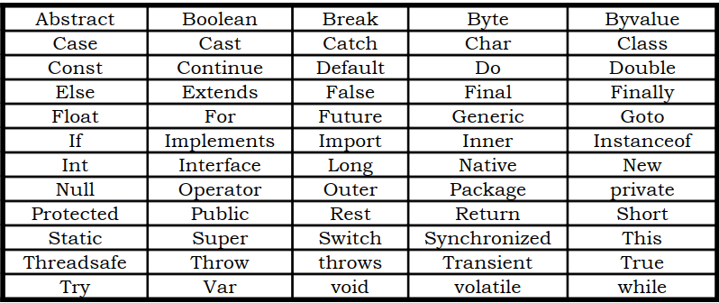

## Keywords in Java
Keywords are an essential part of a language definition. They implement specific features of the language. Java language has reserved 60 words as keywords. These keywords, combined with operators and separators according to a syntax, form definition of the Java language.

- Since keywords have specific meaning in Java, we cannot use them as names for variables, classes, methods and so on.
- All keywords are to be written in lower-case letters.
- Since Java is case sensitive, one can use these words as identifiers by changing one or more letters to upper case.
- However, it is a bad practice and should be avoided.
- Java does not use many of C/C++ keywords and, on the other hand, had added as many as 27 new keywords to implement the new features of the language.

- A list of Java keywords or reserved words with explanation are given below:

- boolean
   - declares a boolean variable or return type
- byte	
   - declares a byte variable or return type
- char	
   - declares a character variable or return type
- double
   - declares a double variable or return type
- float	
   - declares a floating point variable or return type
- short	
   - declares a short integer variable or return type
- void	
   - declare that a method does not return a value
- int	
   - declares an integer variable or return type
- long	
   - declares a long integer variable or return type
- while	
   - begins a while loop
- for	
   - begins a for loop
- do	
   - begins a do while loop
- switch	
   - tests for the truth of various possible cases
- break	
   - prematurely exits a loop
- continue
   - prematurely return to the beginning of a loop
- case
   - one case in a switch statement
- default
   - default action for a switch statement
- if
   - execute statements if the condition is true
- else
   - signals the code to be executed if an if statement is not true
- try
   - attempt an operation that may throw an exception
- catch
   - handle an exception
- finally
   - declares a block of code guaranteed to be executed
- class
   - signals the beginning of a class definition
- abstract
   - declares that a class or method is abstract
- extends
   - specifies the class which this class is a subclass of
- final
   - declares that a class may not be subclassed or that a field or method may not be overridden
- implements
   - declares that this class implements the given interface
- import
   - permit access to a class or group of classes in a package
- instanceof
   - tests whether an object is an instanceof a class
- interface
   - signals the beginning of an interface definition
- native
   - declares that a method is implemented in native code
- new
   - allocates a new object
- package
   - defines the package in which this source code file belongs
- private
   - declares a method or member variable to be private
- protected
   - declares a class, method or member variable to be protected
- public
   - declares a class, method or member variable to be public
- return
   - returns a value from a method
- static
   - declares that a field or a method belongs to a class rather than an object
- super
   - a reference to the parent of the current object
- synchronized
   - Indicates that a section of code is not thread-safe
- this
   - a reference to the current object
- throw
   - throw an exception
- throws
   - declares the exceptions thrown by a method
- transient
   - This field should not be serialized
- volatile
   - Warns the compiler that a variable changes asynchronously
- Two other keywords, const and goto, are reserved by Java but are not actually implemented.
- This allows compilers to produce better error messages if these common C++ keywords are improperly used in a Java program.