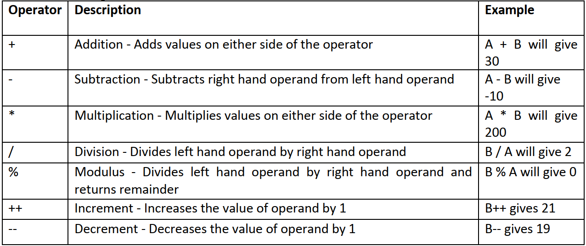
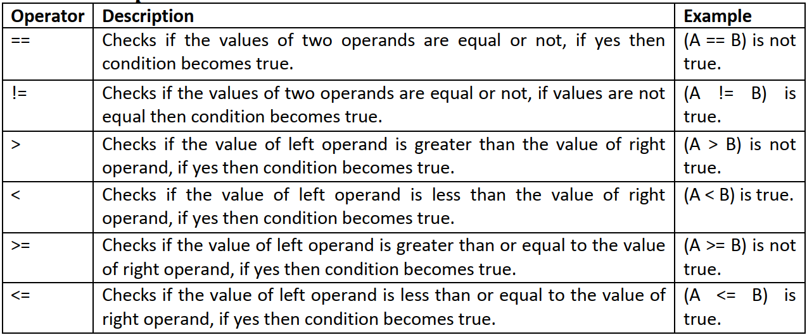
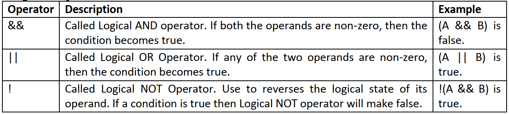
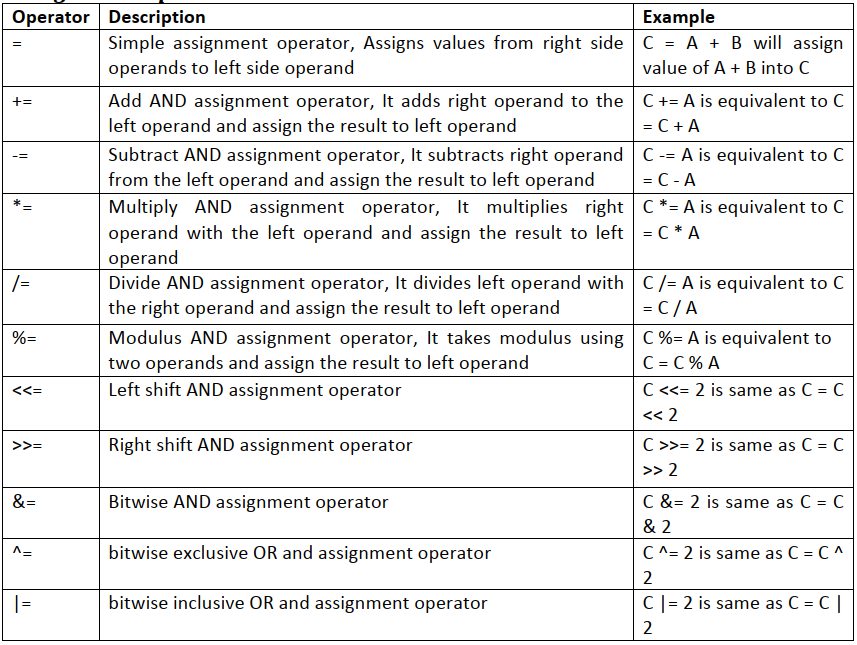
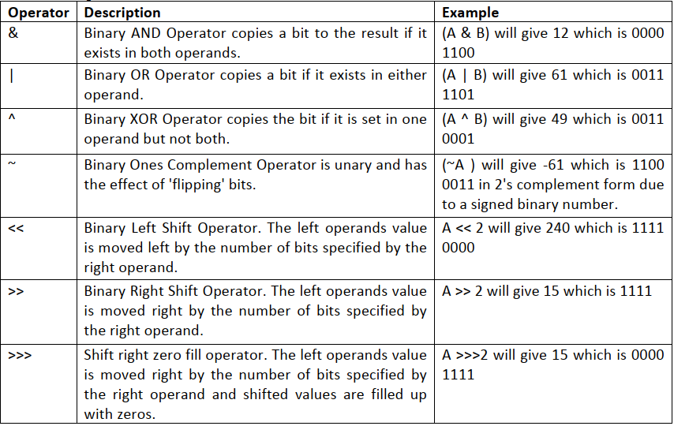

## Operator in Java
Java provides a rich operator environment. An operator is a symbol that tells the computer to perform certain mathematical or logical manipulations. Operators are used in programs to manipulate data and variables. They usually form a part of mathematical or logical expressions. Java operators can be classified into a number of related categories as below:

1. Arithmetic operators
2. Relational operators
3. Logical operators
4. Assignment operators
5. Increment and decrement operators
6. Conditional operators.
7. Bitwise operators
8. Special operators

## Arithmetic Operators
- Arithmetic operators are used in mathematical expressions in the same way that they are used in algebra.
- The arithmetic operators perform addition, subtraction, multiplication, division, exponentiation, and modulus operations.

## Relational Operators
- It is often needed compare two quantities, and depending on their relation, take certain decisions.
- The relational operators determine the relationship that one operand has to the other.
- Specifically, they determine equality and ordering.
- The result of these operations is a Boolean value.
- The relational operators are most Generally used in the expressions that control the if statement and the various loop statements.

## Logical Operators
- The Boolean logical operators shown here operate only on Boolean operands.
- All of the binary logical operators combine two Boolean values to form a resultant.
- Generally logical operators are used when compound statements are formed by combining the relations.

## Assignment Operator
- Assignment operator are used to assign the value to the variable of an expression evaluated.
- The assignment operators provide three benefits.
- They save you a bit of typing, because they are “shorthand” for their equivalent long forms. Since no need the repeat the variable.
- They are implemented more efficiently by the Java run-time system than are their equivalent long forms.
- Statement are easier and concise in reading. For these reasons, you will often see the assignment operators used in professionally written Java programs.

## Bitwise Operator
- Java has a distinction of supporting special operators known as bitwise operators for manipulation of data at values of bit level.
- These operators are used for testing the bits, or shifting them to the right or left.
- Bitwise operators may not be applied to float or double.

## Increment and Decrement Operator
- The ++ and the — are Java’s increment and decrement operators.
- The increment operator increases its operand by one.
- The decrement operator decreases its operand by one.
~~~
Example, this statement x = x + 1 can be rewritten like this by use of the increment operator x++;
Similarly, x = x – 1 is equivalent to x–. While ++mk and km++ mean the same thing when they form statements independently,
they behave differently when they are used in expressions on the right-hand side of an assignment statement.
~~~
- A prefix operator first adds 1 to the operand and then the result is assigned to the variable on left.
- On the other hand, a postfix operator first assigns the value to the variable on left and then increments the operand.
~~~
Let ,m = 10 and n = 20, then m = 10 , n=20 , ++m = 11 , n++ = 20 , m=11 , n = 21 , a = 10 , a[i++]=10.
~~~
## Conditional Operator
- Java includes a ternary (three-way) operator that can replace certain types of if-then-else statements.
- This operator is the ? : , and it works in Java much like it does in C, C++, and C#.
- expression1 ? expression2 expression3
   - Expression1 can be any expression that evaluates to a Boolean value. If
   - expression1 is true, then expression2 is evaluated; otherwise, expression3 is evaluated.
   - ratio = denom == 0 ? 0 : num / denom;
   - If value of ratio is equal to zero then value of ratio will be equal to 0 and for any other value ratio will get value equal to num/denom

## Special Operator
- Java supports some special operators of interest such as instanceof operator and member selection operator (.).

## Instanceof Operator
- The instanceof is an object reference operator and returns true if the object on the left-hand side is an instance of the class given on the right-hand side.
- This operator allows us to determine whether the object belongs to a particular class or not.
- Example: person instanceof student is true if the object person belongs to the class student ; otherwise it is false.

## Dot Operator
- The dot operator (.) is used to access the instance variables and methods of class objects.
~~~
Examples: personl . age / / Reference to the variable age
personl . salary ( ) / / Reference to the method salary()
~~~
- It is also used to access classes and sub-packages from a package.
