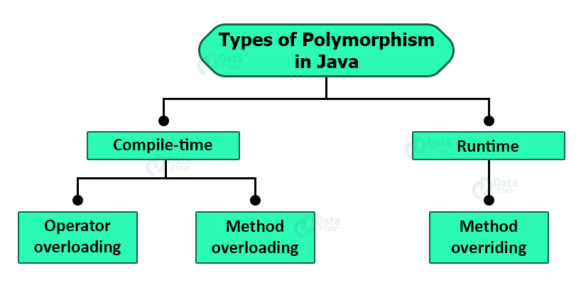
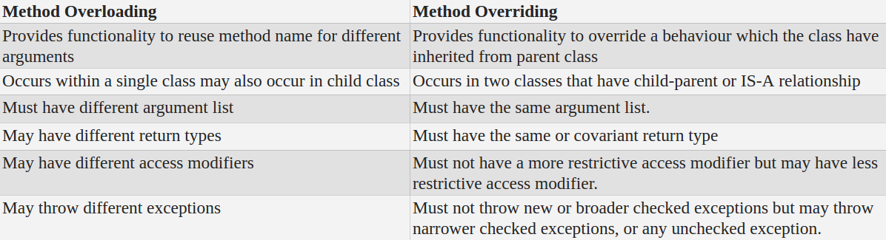

## Polymorphism in Java
Polymorphism is an important concept of object-oriented programming. It is the ability of an entity to take several forms. Polymorphism is derived from 2 Greek words: poly and morphs. The word “poly” means many and “morphs” means forms. So polymorphism means many forms. It is the capability of a method to do different things based on the object that it is acting upon. In other words, it refers to the ability of an object (or a reference to an object) to take different forms of objects. It allows a common data-gathering message to be sent to each class.

## Example: Communication
- Suppose you have a smartphone for communication.
- The communication mode you choose could be anything.
- It can be a call, a text message, a picture message, mail, etc.
- So, the goal is common that is communication, but their approach is different. This is called Polymorphism.
## Example- + Operator
- The + operator in Java is used to perform two specific functions.
- When it is used with numbers (integers and floating-point numbers), it performs addition.
- When we use + operator with strings, it performs string concatenation.
## Example-Human
- Man is only one, but he takes multiple roles like – he is a dad to his child, he is an employee, a salesperson and many more.
- This is also known as Polymorphism.
## Types of Polymorphism
- In Java, Polymorphism can be divided into two types:
- Compile-time Polymorphism
- Run-time Polymorphism

## Compile Time Polymorphism
- Polymorphism that is resolved during compiler time is known as static polymorphism.
- Method overloading is an example of compile time polymorphism.

## Methods Overloading
- In Java it is possible to create methods that have the same name, but different parameter lists and different definitions. This is called method overloading.
- Method overloading is used when objects are required to perform similar tasks but using different input parameters.
- When we call a method in an object, Java matches up the method name first and then the number and type of parameters to decide which one of the definitions to execute.
- This process is known as polymorphism.
- To create an overloaded method, all we have to do is to provide several different method definitions in the class, all with the same name, but with different parameter lists.
- That is, each parameter list should be unique.
- While overloaded methods may have different return types, the return type alone is insufficient to distinguish two versions of a method.
- Thus, overloaded methods must differ in the type and/or number of their parameters.
## Run-time Polymorphism
- It is also known as Dynamic Method Dispatch.
- Dynamic polymorphism is a process in which a call to an overridden method is resolved at runtime, thats why it is called runtime polymorphism
- Method Overriding is one of the ways to achieve Run-time Polymorphism.
## Method Overriding
- A method defined in a super class is inherited by its subclass and is used by the objects created by the subclass.
- Method inheritance enables us to define and use methods repeatedly in subclasses without having to define the methods again in subclass.
- However, there may be occasions when we want an object to respond to the same method but have different behavior when that method is called.
- That means, we should override the method defined in the superclass.
- This is possible by defining a method in the subclass that has the same to same arguments and same return type as a method in the superclass.
- Then, when that methods is called, the method defined in the subclass is invoked and executed instead of the one in the superclass.
- This is known as overriding.
- Method overriding is the creation of a method in the subclass that has the same signature, i.e., name, number and type of arguments, as a method in the super class.
- This new method bides the method of the super class.
- When a method is called on an object, the java compiler first searches for the method in the class of that object.
- If the method is not found there, then the compiler searches for the method in the hierarchy until it is found.
## Difference Between Method Overloading and Overriding in Java
