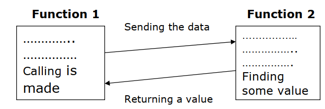

## Function in C
A function is a block of code that performs a specific task.

- It has a name and it is reusable .
- It can be executed from as many different parts in a program as required, it can also return a value to calling program.
- All executable code resides within a function. It takes input, does something with it, then give the answer.
- A C program consists of one or more functions.
- A computer program cannot handle all the tasks by itself. It requests other program like entities called functions in C.
- We pass information to the function called arguments which specified when the function is called.
- A function either can return a value or returns nothing. Function is a subprogram that helps reduce coding.
## How works Function

- The function takes a data from main () function and returns a value.
- To invoke a function call is made in the main () function.
- The function which sends the data to the function is called as the Calling Function and the function which is called by the calling function is called as the Called Function. This is described as given below.

- To understand what a function is consider the program given below.
~~~js
main( )
    {
    message( ) ;
    printf ( "\nCry, and you stop the monotony!" ) ;
    }
message( )
    {
    printf ( "\nSmile, and the world smiles with you..." ) ;
    }

Output:
Smile, and the world smiles with you...
Cry, and you stop the monotony!
~~~
### Explanation

- Here, main( ) itself is a function and through it we are calling the function message( ).
- The activity of main( ) is temporarily suspended; it falls asleep while the message( ) function wakes up and goes to work.
- When the message( ) function runs out of statements to execute, the control returns to main( ), which comes to life again and begins executing its code at the exact point where it left off.
- Thus, main( ) becomes the ‘calling’ function, whereas message( ) becomes the ‘called’ function.
## Library functions and User defined functions:
- C functions can be classified into two categories, namely library functions and user-defined functions. The library functions are standard functions available within C-Language library (built in functions) but user defined function are functions that are created by the user.

   - Library Function
   - User Defined Function
## Library Functions in C

- C provides library functions for performing some operations. These functions are present in the c library and they are predefined.
- For example sqrt() is a mathematical library function which is used for finding the square root of any number .
- The function scanf and printf() are input and output library function similarly we have strcmp() and strlen() for string manipulations.
- To use a library function we have to include some header file using the preprocessor directive #include.
- For example to use input and output function like printf() and scanf() we have to include stdio.h,
- for math library function we have to include math.h for string library string.h should be included.
## User Defined Functions in C

- A user can create their own functions for performing any specific task of program are called user defined functions.
## Advantages of Functions

- It facilitates top down modular programming. In this programming style, the high level logic of the overall problem is solved first while the details of each lower level functions is addressed later.
- The length of the source program can be reduced by using functions at appropriate places. This factor is critical with microcomputers where memory space is limited.
- It is easy to locate and isolate a faulty function for further investigation.
- A function may be used by many other programs this means that a c programmer can build on what others have already done, instead of starting over from scratch.
- A program can be used to avoid rewriting the same sequence of code at two or more locations in a program. This is especially useful if the code involved is long or complicated.
- Programming teams does a large percentage of programming. If the program is divided into subprograms, each subprogram can be written by one or two team members of the team rather than having the whole team to work on the complex program.
## Functions are used in C for the following reasons:

- Many programs require that a specific function is repeated many times instead of writing the function code as many timers as it is required we can write it as a single function and access the same function again and again as many times as it is required.
- We can avoid writing redundant program code of some instructions again and again.
- Programs with using functions are compact & easy to understand.
- Testing and correcting errors is easy because errors are localized and corrected.
- We can understand the flow of program, and its code easily since the readability is enhanced while using the functions.
- A single function written in a program can also be used in other programs also.