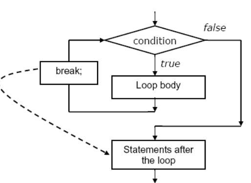
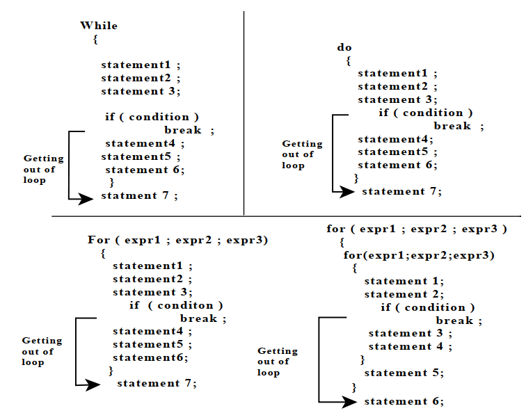

## Break Statement in C
The break statement is used to terminate loops or to exit from a switch. It is used within loop structures namely for, while, do-while and switch statement.

- Break is a keyword in C which is used to bring the program control out of the loop.
- The break statement breaks the loop one by one, i.e., in the case of nested loops, it breaks the inner loop first and then proceeds to outer loops.
## Flow Diagram
- The control flow diagram of break statement is given below

- The break statement included in a while, do while or for loop then control will immediately be transferred out of loop when break statement is executed.
- In case of several nested while, do while, for or a switch statement a break statement will cause a transfer of control out of immediately enclosing statement but not out of outer surrounding statement.
~~~js
Syntax of Break Statement in C

break;
~~~
- In this syntax, break is the keyword.
- Some of the Use of Break Statement are

## Break Statement Within Loops
- A break within a loop is generally protected within an if statement. This provides control towards the exit condition. This depicted in the below example. The following examples illustrate the use of the break statement in loops.
~~~js
while () {
    if ()
    break;
}
// control jumps down here on the break
~~~
### Example-1: Write a program to illustrate the functioning of break statement inside a for loop.
~~~js
//Write a program to illustrate the functioning of break statement inside a for loop.
#include<stdio.h>
int main()
    {
    int i;
    for (i = 1; i < 10; i++)
        {
        printf("%d\n", i);
        if (i == 4)
            break;
        }
    }
~~~
~~~
Output:
1 2 3 4
~~~
### Analysis:

- Here break statement is given with respect to the if condition.
- When variable i value gets equal to four, loop gets terminated because of break statement.
### Example-2: Write a program to illustrate break statement within infinite for loop.
~~~js
//Write a program to illustrate break statement within infinite for loop.
#include<stdio.h>
main()
    {
    int t ;
    for ( ; ; )
        {
        scanf("%d" , &t);
        if ( t==10 )
            break ;
        }
    printf("End of an infinite loop...\n");
    }
~~~
### Example-3: Write a program to illustrate break statement within infinite while loop.
~~~js
//Write a program to illustrate break statement within infinite while loop.
#include<stdio.h>
main()
    {
    int c;
    printf("Enter a character:(Enter x to exit)\n");
    while (1)
        {
        c = getc(stdin);
        if (c == 'x')
            break;
        }
    printf("Break the infinite while loop. Bye!\n");
    }
~~~
~~~
Output:
Enter a character:(Enter x to exit)
x
Break the infinite while loop. Bye!
~~~