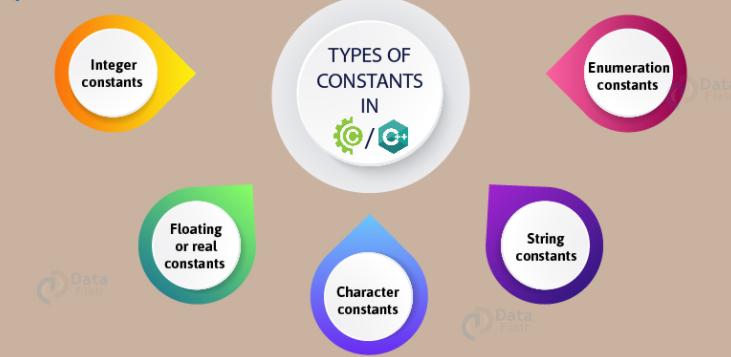
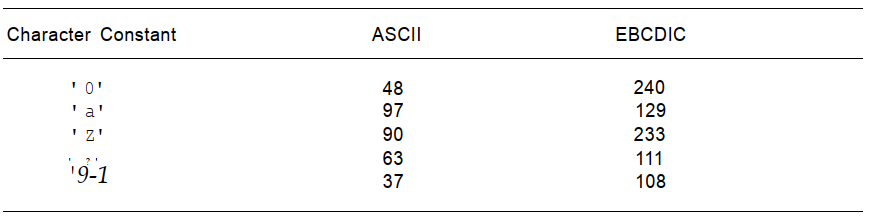
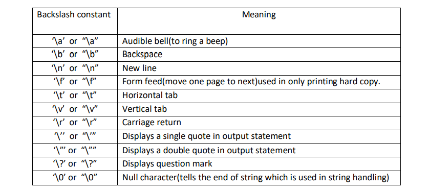

## Constant in C

A constant is an entity whose value does not change during program execution. Constants are of five different types: integer,
floating-point, character, and string.

## Integer Constant

An integer constant refers to a sequence of digits. There are three types of integers, namely, decimal integer, octal integer and hexadecimal integer.
## Decimal Integer Constant
A decimal integer constant consists of a sequence of one or more decimal digits 0 through 9. The first digit of the sequence cannot be 0, unless the decimal
integer constant is 0. Thus, 0, 255, 32767, 32768, 65535, 2147483647 are valid decimal integer constants.

## Octal Integer Constant
 An octal integer constant consists of the digit 0, followed by a sequence of one or more octal digits 0 through 7. Thus, 012, 037, 0177, 01000, 077777, 0100000 are valid
octal integer constants corresponding to the decimal integer constants 10, 31, 127, 4096, 32767, 32768 respectively.

## Hexadecimal Integer Constant
A hexadecimal integer constant consists of the digit 0, followed by one of the letters x or X, followed by a sequence of one or more hexadecimal digits 0 through 9, or
letters a through f, or letters A through F. Thus, Oxlf, OXIF, Oxff, OxABC, 0x10000, 0x7FFFFFFF are valid hexadecimal integer constantscorresponding to the decimal integer
constants 31, 31, 255, 2748, 65536, 2147483647 respectively.

## Rules for Constructing Integer Constants
- An integer constant must have at least one digit.
- It must not have a decimal point.
- It can be either positive or negative.
- If no sign precedes an integer constant it is assumed to be positive.
- No commas or blanks are allowed within an integer constant.
- The allowable range for integer constants is -32768 to 32767.
## Floating-Point/Real Constants
Integer numbers are inadequate to represent quantities that vary continuously, such as distances, heights, temperatures, prices, and so on. These quantities are represented
by numbers containing fractional parts like 17.548. Such numbers are called real (or floating point) constants. Further examples of real constants are: 0.0083, –0.75, 435.36, +247.0

These numbers are shown in decimal notation, having a whole number followed by a decimal point and the fractional part. It is possible to omit digits before the decimal point,
or digits after the decimal point. That is, 215. .95 –.71 +.5 are all valid real numbers.

Real constants are often called Floating Point constants. The real constants could be written in two forms—Fractional form and Exponential form.

## Following rules must be observed while constructing real constants expressed in fractional form:
- A real constant must have at least one digit.
- It must have a decimal point.
- It could be either positive or negative.
- Default sign is positive.
- No commas or blanks are allowed within a real constant.

## Following rules must be observed while constructing real constants expressed in exponential form:
- The mantissa part and the exponential part should be separated by a letter e.
- The mantissa part may have a positive or negative sign.
- Default sign of mantissa part is positive.
- The exponent must have at least one digit, which must be a
- positive or negative integer. Default sign is positive.
- Range of real constants expressed in exponential form is -3.4e38 to 3.4e38.

## Character Constants
A single character constant (or simply character constant) contains a single character enclosed within a pair of single quote marks.
Character constants are of type int.The value of a character constant is the numeric value of the character in the machine’s character
set, and hence depends on whether the machine uses the ASCII or EBCDIC character set.


Note that the character constant ‘5’ is not the same as the number 5. The last constant is a blank space. Character constants have integer
values known as ASCII values. For example, the statement would print the number 97, the ASCII value of the letter a.

## Rules for Constructing Character Constants
- A character constant is a single alphabet, a single digit or a single special symbol enclosed within single inverted commas. Both the inverted
commas should point to the left. For example, ’A’ is a valid character constant whereas ‘A’ is not.
- The maximum length of a character constant can be 1 character. Ex.: ‘A’ ‘I’, ‘5’ ‘=’.

## String Constants
A string constant, or simply a string, consists of zero or more characters enclosed within double quotation marks. Non-graphic characters may also
be used as part of a character string. Here are some examples:
```js
"Madam, I'm Adam"
"Programming in C is fun\n"
"\n\n\t\t***** inventory report *****\n\n"
```
The length of a string is the number of characters that form the string. There is no limit on the length of a string.
## Backslash Character Constants
C supports some special backslash character constants that are used in output functions. For example, the symbol ‘\n’ stands for newline character.



A list of such backslash character constants is given in above. Note that each one of them represents one character, although they consist of two characters.
These characters’ combinations are known as escape sequences.
