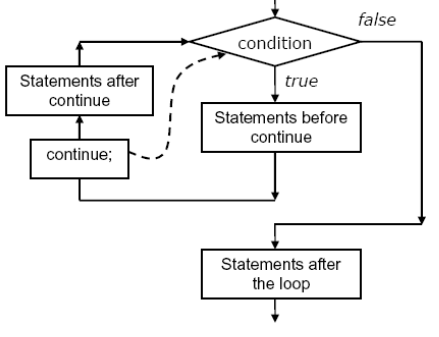

## Continue Statement in C
A continue statement is used within loops to end the execution of the current iteration and proceed to the next iteration.

- It provides a way of skipping the remaining statements in that iteration after the continue statement.
- It is important to note that a continue statement should be used only in loop constructs and not in selective control statements.
- For better control over the program, like a break statement, continue is generally used in conjunction with if structure within loops. When continue is used the next iteration of a do, for, or while statement is determined as follows:

- In a while loop, jump to the test statement.
- In a do while loop, jump to the test statement.
- In a for loop, jump to the test, and perform the iteration. Then the compiler reevaluates the conditional expression and, depending on the result, either terminates or iterates the statement body
- One good use of continue is to restart a statement sequence when an error occurs. Using the continue statement, as well as the break statement, may makes program hard to debug
## Flow Diagram
- The control flow diagram of continue statement in C is given below-

- It is used to bypass the remainder of current pass through the loop.
- The loop doesn’t terminate when only one continue statement is encountered.
- The remaining loop statements are skipped and the
- computation proceeds directly to next pass through the loop.
- The continue statement can be included within or a for statement.
- Continue statement terminates only the current iteration of the loop that immediately encloses it. Thus causing execution to resume with iteration.
~~~js
Syntax
continue;
where continue is the keyword.
~~~
- The format of using continue in while loop and some examples of continue statement is given below
~~~js
while ()
    {
    ...
    if ()
        continue;
    ...
    ...
    // control jumps here on the continue
    }
~~~
### Example-1: Write a program to find the sum Using the continue statement in for loop.
~~~js
//Write a program to find the sum Using the continue statement in for loop.
#include<stdio.h>
main()
    {
    int i, sum;
    sum = 0;
    for (i=1; i<8; i++)
        {
        if ((i==3) || (i==5))
        continue;
        sum += i;
        }
    printf("The sum of 1, 2, 4, 6, and 7 is: %d\n", sum);
    }
~~~
~~~
Output:
The sum of 1, 2, 4, 6, and 7 is:20
~~~
### Analysis

- Program is to calculate the sum of the integer values of 1, 2, 4, 6, and 7. because the integers are almost consecutive.
- The statement sum += i; sums all integers from 1 to 7 except for 3 and 5,.3nad 5 are skipped in the for loop by using continue statement.
- This is done by evaluating the expression (i==3) || (i==5) in the if statement.
- If the expression returns 1 (that is, the value of i is equal to either 3 or 5), the continue statement is executed, which causes the sum operation to be skipped, and another iteration to be started at the beginning of the for loop.
- In this way, the sum of the integer values of 1, 2, 4, 6, and 7 is obtained, but 3 and 5are skipped, automatically by using continue statement in for loop.
- After the for loop, the value of sum, 20, is displayed on the screen by the printf() function .
### Example-2: Write a program to find the odd numbers using continue statement in while loop.
~~~js
//Write a program to find the odd numbers using continue statement in while loop.
#include<stdio.h>
main ()
    {
    int x;
    x = 0;
    while (x < 10)
        {
        ++x;
        if (x % 2 == 0)
            {
            continue;
            }
        printf ("%i is an odd number.\n", x);
        }
    }
~~~
~~~
Output:
1 is an odd number.
3 is an odd number.
5 is an odd number.
7 is an odd number.
9 is an odd number.
~~~
## Goto and Labels in C
- The goto statement allows control to be transferred from one point in a function to any other point in that function. This action is called as branching. The goto statement instructs computer to resume execution at a specified statement. The location of this statement is specified by a label, which is an identifier followed by a colon( : ) A label must be placed immediately before a statement and with the bound of the function.

## goto label_name
- When this statement encounters the computer resumes execution at the statement.
- Immediately following the label label_name. A label can occur before or after goto statement that references it. i.e the jump can be either forward or backward.
- The naming rules for label are same as for
- variable except that it is not declared.
~~~js
Format of goto statement is given below

for ( ... )
    statement
for ( ... )
    {
    ...
    if (disaster)
    goto error;               /* Here semicolon is associated with the label
    error*/
    }
error: Statemnt;        /* Here colon(:) is associated with the label error*/
~~~
### Analysis:

- Here error is a label name that tells the goto statement where to jump.
- Label name is placed in two places: One is at the place where the goto statement is going to jump (note that a colon must follow the label name), and the other is the place following the goto keyword.
- The rules to name a variable also applies to label also. Also, the place for the goto statement to jump can appear either before or after the statement.
- They are called forward goto or backward goto statements respectively.
### Example-3: Write a program to understand the functioning of the goto statement.
~~~js
//Write a program to understand the functioning of the goto statement.
#include<stdio.h>
int main()
    {
    int i, j;
    for ( i = 0; i < 10; i++ )
        {
        printf( "Outer loop executing. i = %d\n", i );
        for ( j = 1; j < 3; j++ )
            {
            printf( " Inner loop executing. j = %d\n", j );
            if ( i == 2 )
                goto stop;
            }
        }
    printf( "Loop is quit. i = %d\n", i );
    stop:
        printf( "Jumped to stop. i = %d\n", i );
    }
~~~
~~~
Output:
Outer loop executing. i =0
Inner loop executing. j =1
Outer loop executing. i =1
Inner loop executing. j =2
Outer loop executing. i =2
Inner loop executing. j =1
Jumped to stop. I=2
~~~
### Analysis:

- In this example, a goto statement transfers control to the point labeled stop when i equals 2.
### Example-4: Write a C program program to illustrate use of goto and label statement
~~~js
// Write a C program program to illustrate use of goto and label statement
#include<stdio.h>
main()
    {
    int i,j,k;
    printf(" Enter no i and j");
    scanf("%d %d",&i,&j);
    if(i==0)
        goto lbb;
    else
        goto l2;
    lbb:
        printf("\n no. is divided by zero divide error");
    l2:
        k=i/j;
    printf("\n %d divided by %d=%d",i,j,k);
    printf("\n");
    }
~~~
~~~
Output:
Enter no i and j: 6 3
6 divided by 3= 2
~~~