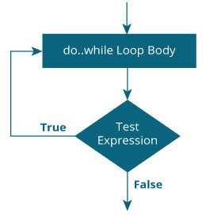

## Do While Statement in C
Do While is one of the looping control statements in C Programming. It is also called as exit controlled looping control statement. i.e., it tests the condition after executing the do-while loop body.

- The while loop and for loops test the termination condition at the beginning of the loop.
- By contrast, the do-while loop, tests at the bottom after making each pass through the loop body; the body is always executed at least once.
- In real life programming one comes across a situation when it is not known beforehand how many times the statements in the loop are to be executed.
## Flow Diagram
- The flow diagram of do while loop in C statement is given below

- Whenever do-while statement is encountered, the initialization statement gets executed first.
- After then, the control enters into do-while loop body and all the statements in that body will be executed.
- When the end of the body is reached, the condition is tested again with the updated loop counter value.
- If the condition returns the value false, the control transfers to next statement without executing do-while loop body.
- Hence, it states that, the do-while loop body gets executed for the first time, though the condition returns the value false.
## Syntax of Do While Statement
~~~js
Initialization statement;
do
    { statement(s);
    } while(condition);
next statement;
~~~
- While and do are the keywords.
- The condition is a relational expression or a compound relational expression or any expression that returns either true or false.
- Initialization statement, statement(s) and next_statement are valid C statements.
- The statements within the curly braces are called as do-while loop body.
- The updating statement should be included with in the do-while loop body.
- There should be a semi-colon (;) at the end of while().
### Example-1: Write a C program to print n natural numbers using using do while loop.
~~~js
//Write a C program to print n natural numbers using using do while loop.
#include<stdio.h>
int main()
    {
    int i,n;
    printf("Enter the range\n");
    scanf("%d",&n);
    i=1;
    do
        {
        printf("%d\n",i);
        i=i+1;
        }
    while(i<=n);
    }
~~~
~~~
Output:
Enter the range: 100
1 2 3 4 5 ..............100
~~~
### Example-2: Write a C program to enter a number and than add up the values of each of it’s individual digits using do while loop.
~~~js
// Write a C program to enter a number and than add up the values of each of it's individual digits using do while loop.
#include<stdio.h>
main()
    {
    int n,sum=0,right;
    printf("\n Enter the Number: ");
    scanf("%d",&n);
    do
        {
        right=n%10;
        sum=sum+right;
        n=n/10;
        }
    while(n>0);
    printf("\n The sum of digits is %d",sum);
    }
~~~
~~~
Output:
Enter the Number: 321
The sum of digits is: 6
~~~
### Example-3:  Write a C program to enter a number to square and continue until press No using do while loop.
~~~js
// Write a C program to enter a number to square and continue until press No using do while loop.
#include<stdio.h>
main( )
    {
    char another ;
    int num ;
    do
        {
        printf ( "Enter a number: " ) ;
        scanf ( "%d", &num ) ;
        printf ( "square of %d is %d", num, num * num ) ;
        printf ( "\nWant to enter another number y/n: " ) ;
        scanf ( " %c", &another ) ;
        }
    while ( another == 'y' ) ;
    }
~~~
~~~
Output:
Enter a number: 5
square of 5 is 25
Want to enter another number y/n:y
Enter a number: 10
square of 10 is 100
Want to enter another number y/n:n
~~~
### Explanation

- In this program the do-while loop would keep getting executed till the user continues to answer y.
- The moment he answers n, the loop terminates, since the condition (another == ‘y’) fails.
- Note that this loop ensures that statements within it are executed at least once even if n is supplied first time itself.
### Example-4: Write a C program to enter a password and check weather correct or not at least three times using do while loop.
~~~js
// Write a C program to enter a password and check weather correct or not at least three times using do while loop.
#include<stdio.h>
int main(void)
    {
    int pass_word= 15;
    int code;
    int i=3;
    do
        {
        printf("Type the password to enter.\n");
        scanf("%d", &code);
        if (code==15)
            printf("Right code. You can Enter\n");
        else
            printf("Wrong code. No Entry\n");
        i=i-1;
        }
    while(i!=0);
    }
~~~
~~~
Output:
Type the password to enter: 13
Wrong code. No Entry
Type the password to enter:15
Right code. You can Enter
~~~
### Explanation

- Here do part is executed to know the password.
- If it is right, entry is given otherwise not. Loop will repeat only for three set of inputs.
- For the fourth set variable i value does not satisfy the while condition. Hence loop is quit.
## Limitation of Do-while Loop

- In Do-while, the loop the is executed as least once before checking the validity condition.
- In Do-while structure entry to the loop is automatic (even with invalid input).
- Choice is given only for the continuation of the loop. Such problems are deemed to be lack of control.
## Difference Between the while and do-while loop

- In the do-while loop, the body of a loop is always executed at least once. After the body is executed, then it checks the condition.
- If the condition is true, then it will again execute the body of a loop otherwise control is transferred out of the loop.
- Similar to the while loop, once the control goes out of the loop the statements which are immediately after the loop is executed.
- The critical difference between the while and do-while loop is that in while loop statement will be executed when condition true but in do while loop statement will be executed once either condition true or false.
- In addition, in the while loop, while is written at the beginning and in do-while loop, the while condition is written at the end and terminates with a semi-colon (;).