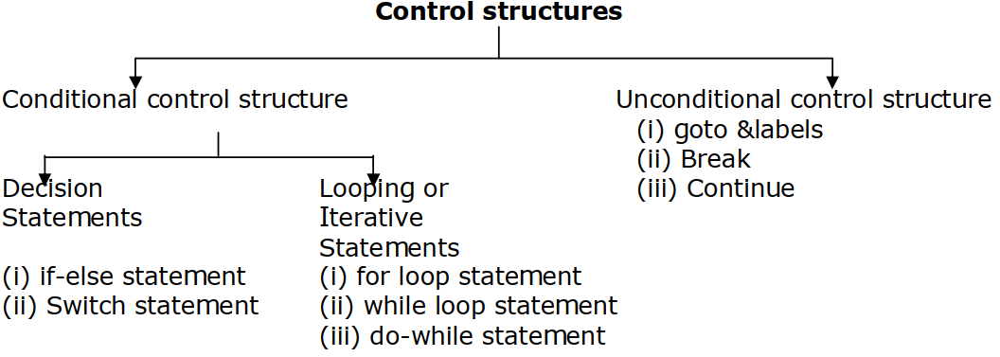
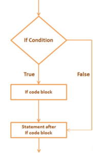

## Conditional Statements in C
A conditional statement allows selective processing of a statement or a group of statements.

- There are two forms of conditional statements: the if statement and the if-else statement.
- The first form begins with the key word if, followed by an expression in parentheses, followed by a statement.
- The second form also begins with the keyword if, followed by an expression in parentheses, followed by a statement.
- In addition, it has appended to it the keyword else, followed by another statement.

## if Statement
The if statement is used to specify conditional execution of a program statement, or a group of statements enclosed in braces. The general format of this statement is
```js
if (test_expression)
    {
    statement-block;
    }
statement-x;
```
- The ‘statement-block’ may be a single statement or a group of statements.
- If the test expression is true, the statement-block will be executed; otherwise the statement-block will be skipped and the execution will jump to the statement-x.
- Remember, when the condition is true both the statement-block and the statement-x are executed in sequence.
## Flow Diagram
The flow of control using if…statement is determined as follows:


- Whenever simple if statement is encountered, first the condition is tested. It returns either true or false.
- If the condition is false, the control transfers directly to statement after if block without considering the true statement block.
- If the condition is true, the control enters into the true statement block. Once, the end of statement block is reached, the control transfers to statement after if block.
Here are some examples:
```js
if (number < 0)
    number = -number;
printf("%d\n", number);
```
- If the number has a negative value, the logical expression number < 0 evaluates to 1 (true), and the assignment statement converts the negative value into
a positive value, which is assigned to number.
- If the number has nonnegative value, the logical expression evaluates to 0 (false), and the assignment statement is not executed.
- In either case, the printf function is executed next and it prints the absolute value of number.
```js
if (age > 1 8 && salary < 250)
    {
    unemployed++;
    total_age += age;
    total_salary += salary;
    }
```
- If the age of the person is more than 18 and the person’s salary is less than $250, the three statements enclosed in braces are executed.
- Consequently, the number of unemployed is incremented by 1 and this person’s age and salary are added to total_age and total salarv respectively.
Some valid forms of if are given below.
```js
if (x > 0)
    printf( “%i”, x);
```
```js
if (a > b)
    printf( “ a is greatest ”);
else
    printf( “ b is greatest ”);
```
```js
if ( a = = b )
    {
    printf( “ a & b are equal ” );
    printf( “ x/a is equal to x/b ”
    )
}
```
Some invalid forms of if are given below.
```js
if ( a > b );
    printf( “a is greatest” );
//The semicolon at the end of condition, makes if ( a >b ) as invalid.
```
```js
if ( a > b )
    statement1;
statement2;
statement3;
//Here multiple statements under if are not enclosed in braces.
```
```js
if ( a > b ){
    Statement 1;
    statement 2;
    . . .
    Statement n;
};
//Here the ending brace has semicolon ( ; )
```
### Example-1: Write a C program to calculate greatest of 3 numbers.
~~~js
/* Write a program to calculate greatest of 3 numbers */
# include<studio.h>
main()
    {
    int a, b, c;
    printf("Enter three numbers");
    scanf ("%d %d %d ", &a, &b, &c);
    if ( ( a > b) && (a > c))
        printf ("\n %d is greatest",a);
    if ( ( b > a) && (b > c))
        printf ("\n %d is greatest,b");
    if ( ( c > a) && (c > b))
        printf ("\n %d is greatest",c);
    }
~~~
~~~
Output:
5
6
7
7 is largest
~~~
### Example-2:  Write c program to find the even number.

~~~js
//Write c program to find the even number.
# include<studio.h>
void main()
    {
    int num=0,n;
    printf("enter the number");
    scanf("%d",&num);
    if(num%2==0)
        {
        printf("%d number is even",num);
        }
    }
~~~
~~~
Output:
Enter a number: 2
2 number is even
~~~
## Example-3: Write a C program to enter a number and check weather less or greater than 10.
~~~js
//Write a C program to enter a number and check weather less or greater than 10.
# include<studio.h>
int main()
    {
    int num;
    printf("Enter a number: ");
    scanf("%d",&num);
    if(num<10)
        {
        printf("The value is less than 10");
        }
    else
        {
        printf("The value is greater than 10");
        }
    return 0;
    }
~~~
~~~
Output:
Enter a number: 12
The value is greater than 10
~~~
### Example-4: Write a C program to enter two number and compare them.
~~~js
//Write a C program to enter two number and compare them. .
# include<studio.h>
int main()
    {
    int x, y;
    printf("Enter the value of x:");
    scanf("%d", &x);
    printf("Enter the value of y:");
    scanf("%d", &y);
    if (x>y)
        {
        printf("x is greater than y\n");
        }
    if (x<y)
        {
        printf("x is less than y\n");
        }
    if (x==y)
        {
        printf("x is equal to y\n");
        }
    printf("End of Program");
    return 0;
    }
~~~
~~~
Output:
Enter the value of x:20
Enter the value of y:20
x is equal to y
End of Program
~~~