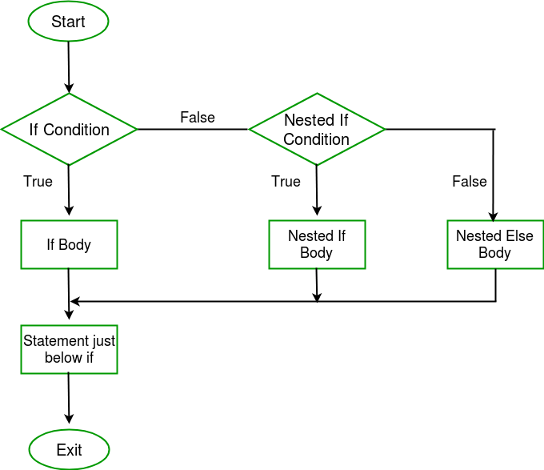

## Nested If-Else Statement
Nested if…else statement is one of the conditional control-flow statements.
- If the body of [if statement](https://funycode.com/if-statement/) contains at least one if statement, then that if statement is called as Nested if…else statement‖.
- The nested if…else statement can be used in such a situation where at least two conditions should be satisfied in order to execute particular set of instructions.
- It can also be used to make a decision among multiple choices.
## Flow Diagram
The flow of control using nested if…else statement is determined as follows:


- Whenever nested if…else statement is encountered, first is tested. It returns either true or false.
- When if-condition (or outer condition) is false, then the control transfers to nested if condition body (if exists) by skipping if-body.
- Then, if nested if condition is true then nested if body will be executed otherwise nested-else body will be executed.
- When if-condition (or outer condition) is true, then if body will be executed.
## Syntax of Nested If Statement:
```js
if (condition1)
{
   Statement-1
   if (condition2)
   {
      Statement-2
   }
  else{
     Statement-3
   }
}
```
## Explanation
- If and else are keywords.
- condition1, condition2, condition3 are relational expressions or logical expressions or any other expressions that return true or false.
- It is important to note that the condition should be enclosed within parentheses ( and ).
- If-body and else-body are simple statements or compound statements or empty statements.
- Statement-1, ststement-2, ststement-3 are valid C statement.

## Another Syntax
```js
if (x < 0)
   sign = -1;
else
   if (x == 0)
      sign = 0;
   else
      sign = 1;
```
## Explanation
- The second if…else statement is nested within else statement of the first if..else.
- If x is less than 0, then sign is set to -1. However, if x is not less than 0, the second if…else statement is executed.
- There, if x is equal to 0, sign is also set to 0. But if x is greater than 0, sign is instead set to 1.
### Example-1: Write a C program to enter a number and check weather the number is less or greater than 50.
```js
// Write a C program to enter a number and check weather the number is less or greater than 50. #include
#include<studio.h>
int main() {
    int num;
    printf("Enter a number:");
    scanf("%d",&num);
    if (num>10)
         if (num>50)
            printf("%d is greater than 10 and 50 \n",num);
         else
            printf("%d is greater than 10 but smaller than 50",num);
    return 0;
    }
```
```
Output:
Enter a number: 15
15 is greater than 10 but smaller than 50
```
### Example-2: Write a C program to enter three number and find the greater one using nested if else statement.
```js
//Write a C program to enter three number and find the greater one using nested if else statement.
#include<studio.h>
void main()
    {
    int a,b,c;
    printf("Enter three values:\n");
    scanf("%d%d%d",&a,&b,&c);
    if(a>b)
      {
       if(a>c)
           printf("%d\n",a);
       else
           printf("%d\n",b);
    }
    else
       {
       if(c>b)
          printf("%d\n",c);
       else
          printf("%d\n",b);
       }
    }
```
```
Output:
Enter three values:
5
10
9
10
```
### Example-3: Write a C program to enter a number either 1 or 2 and show message heaven for 1 and hell for 2 using nested if else statement.
```js
//Write a C program to enter a number either 1 or 2 and show message heaven for 1 and hell for 2 using nested if else statement.
#include<studio.h>
main( )
    {
    int i ;
    printf ( "Enter either 1 or 2 " ) ;
    scanf ( "%d", &i ) ;
    if ( i == 1 )
        printf ( "You would go to heaven !" ) ;
    else
        {
        if ( i == 2 )
            printf ( "Hell was created with you in mind" ) ;
        else
            printf ( "How about mother earth !" ) ;
        }
    }
```
```
Output:
Enter either 1 or 2:
2
Hell was created with you in mind
```
