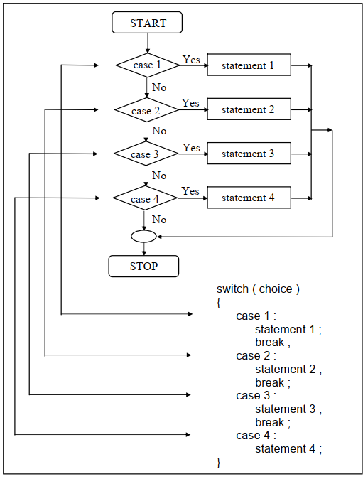

## Switch Statement in C
Switch statement is one of decision-making control-flow statements. Just like else if ladder, it is also used to make a decision among multiple choices.

- This control statement allows us to make a decision from the number of choices, or more correctly a switch case-default, since these three keywords go together to make up the control statement.
- It tests the value of an expression against a list of integer or character constants.
- When a match is found the statements associated with that constants are executed.
## Flow Diagram
- The flow diagram of switch statement is given below-

- Whenever, switch statement is encountered, first the value of gets matched with case values.
- If suitable match is found, the statements block related to that matched case gets executed.
- The break statement at the end transfers the control to the Next-statement.
- If suitable match is not found, the default statements block gets executed and then the control gets transferred to Next-statement.

~~~js
Syntax
switch(expression)
    {
    case 1:
        statements block-1
        break;
    case 2:
        statements block-2
        break;
    case 3:
        statements block-3
        break;
    case 4:
        statements block-N
        break;
    default:
        default statements block
    }
~~~
### Explanation

- Switch, case, default and break are keywords.
- Expression is any expression that should give an integer value or character value. In other words, it should never return any floating-point value. It should always be enclosed with in parentheses ( and ). It should also be placed after the keyword switch.
- Case value should always be integer constants or character constants or constant expressions. In other words, variables can never be used as .
- There should be a space between the keyword case and . The keyword case along with its is called as a case label. should always be unique; no duplications are allowed.
- Statements block-1, statements block-2, statements block-3… statements block-N and default statements block are simple statements, compound statements or null statements. It is important to note that the statements blocks along with their own case labels should be separated with a colon ( : ).
- The break statement at the end of each statements block is an optional one. It is recommended that break statement always be placed at the end of each statements block.
- With absence of break, all the statements blocks below the matched case label along with statements block of matched case get executed. Usually, the result is unwanted.
- The statement block and break statement can be enclosed with in a pair of curly braces { and }.
- The default along with its statements block is an optional one. The break statement can be placed at the end of default statements block.
- The default statements block can be placed at anywhere in the switch statement. If they are placed at any other place other than at end, it is compulsory to include a break statement at the end of default statements block.
- Next-statement is a valid C statement.
## Important Rules for Switch Statement
- The switch variable must be an integer or character type.
- Case labels must be constants of constant expressions.
- Case labels must be unique. No two labels can have the same value.
- Case labels must end with a colon.
- The break statement transfers the program control out of the switch block.
- The break statement is optional. When the break is not written in any ‘case’ then the statements following the next case are also executed until the ‘break’ is not found.
- The default case is optional. If present, it will be executed when the match with any ‘case’ is not found.
- There can be at most one default label.
- The default may be placed any where but generally written at the end.
- When placed at end it is not compulsory to write the ‘break’ for it.
- We can nest the switch statements.
## Switch Versus If-Else Ladder
- There are some things that you simply cannot do with a switch. These are:

- A float expression cannot be tested using a switch Cases can never have variable expressions (for example it is wrong to say case a +3 : )
- Multiple cases cannot use same expressions. Thus the following switch is illegal:

~~~js
switch ( a )
    {
    case 3 :
    ...
    case 1 + 2 :
    ...
    }
~~~
## Difference between switch and If-else Statement

- If-else contains the condition which will evaluates to true or false and switch contains the variable whose value is to be checked.
- If-else supports all types of conditions and switch supports checking only integer and character values.
- Switch works faster than an equivalent if-else ladder statement. The compiler generates a jump table for a switch during compilation. As a result, during execution it simply refers the jump table to decide which case should be executed, rather than actually checking which case is satisfied.
- As against this, if-else’s are slower because they are evaluated at execution time. A switch with 10 cases would work faster than an equivalent if-else ladder.
- Also, a switch with 2 cases would work slower than if-else ladder. If the 10th case is satisfied, then jump table would be referred and statements for the 10th case would be executed. As against this, in an if-else ladder 10 conditions would be evaluated at execution time, which makes it slow.
- A lookup in the jump table is faster than evaluation of a condition, especially if the condition is complex. If on the other hand the conditions in the if-else were simple and less in number, then if-else would work out faster than the lookup mechanism of a switch.
- Hence a switch with two cases would work slower than an equivalent if-else. Thus, you as a programmer should take a decision which of the two should be used when.

### Example-1: Write a C program to enter two number and a choice and calculate the operation according to choice.
~~~js
//Write a C program to enter two number and a choice and calculate the operation according to choice.
#include<studio.h>
void main()
    {
    int a,b,c,ch;
    printf("\nEnter two numbers :");
    scanf("%d%d",&a,&b);
    printf("\nEnter the choice:");
    scanf("%d",&ch);
    switch(ch)
        {
        case 1:
            c=a+b;
            break;
        case 2:
            c=a-b;
            break;
        case 3:
            c=a*b;
            break;
        case 4:
            c=a/b;
            break;
        case 5:
             return;
        }
        printf("\nThe result is: %d",c);
        }
~~~
~~~
Output:
Enter two numbers: 2 5
Enter the choice: 1
The result is 7
~~~
### Example-2: Write a C program to check whether the enter the character is a vowel, a last alphabet or consonant.
~~~js
// Write a C program to check whether the enter the character is a vowel, a last alphabet or consonant.
#include<studio.h>
main()
    {
    char ch;
    printf("\n Enter a lower case alphabeet (a-z):");
    scanf("%c", &ch);
    if ( ch<'a' || ch>'z')
        printf("\n Character is not lower case alphabet");
    else
      switch(ch)
        {
        case 'a' :
        case 'e' :
        case 'i' :
        case 'o' :
        case 'u' :
            printf("\n Entered Character is vowel");
        break;
        case 'z' :
            printf("\n Entered Character is last alphabet");
        break;
        default:
            printf("\n Entered Character is consonant");
        }
    }
~~~
~~~
Output:
Enter a lower case alphabeet (a-z): p
Entered Character is consonant
~~~
### Example-3: Write a C program to choose color using switch case statements.
~~~js
// Write a C program to choose color using switch case statements.
#include<studio.h>
main()
    {
    int a;
    printf("choose the color u like; red-11, blue-22, violet-13:");
    scanf("%d",&a);
    switch(a)
        {
        case 11:
            printf("Congratulations You have selected RED colour");
            break;
        case 22:
            printf("Congratulations you have selected BLUE colour");
            break;
        case 13:
            printf("Congratulations you have selected VIOLET colour");
            break;
        default:
            printf("Really Sorry, Invalid choice");
        }
    }
~~~
~~~
Output:
Choose the color u like; red-11, blue-22, violet-13: 22
Congratulations you have selected BLUE colour
~~~