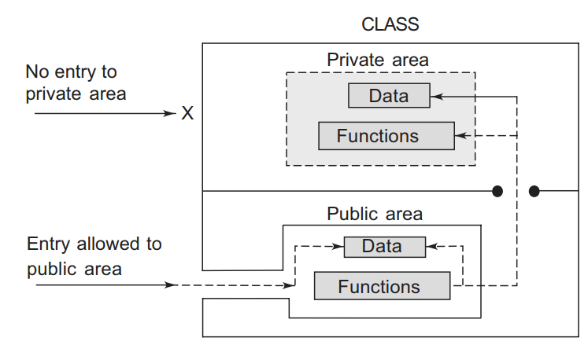

## Class and Object in C++
The main purpose of C++ programming is to add object orientation to the C programming language and classes are the central feature of C++ that supports object-oriented programming and are often called user-defined types.

- A C++ class is like a blueprint for an object.
- A class is used to specify the form of an object and it combines data representation and methods for manipulating that data into one neat package.
- The data and functions within a class are called members of the class.
- A class in C++ is the building block, that leads to Object-Oriented programming.
- It is a user-defined data type, which holds its own data members and member functions, which can be accessed and used by creating an instance of that class.
- A Class is a user defined data-type which has data members and member functions.
- Data members are the data variables and member functions are the functions used to manipulate these variables.
- Together these data members and member functions defines the properties and behavior of the objects in a Class.

### Example-1: Consider the Class of Cars.
There may be many cars with different names and brand but all of them will share some common properties like all of them will have 4 wheels, Speed Limit, Mileage range etc.
So here, Car is the class and wheels, speed limits, mileage are their properties.

### For Example-2: Consider the Class of birds
All birds can fly and they all have wings and beaks.
So here flying is a behavior and wings and beaks are part of their characteristics.
And there are many different birds in this class with different names but they all possess this behavior and characteristics.

## Declaration of Class
- A class is a way to bind the data and its associated functions together.
- It allows the data (and functions) to be hidden, if necessary, from external use.
- When defining a class, we are creating a new abstract data type that can be treated like any other built-in data type.
- Generally, a class specification has two parts:
   - Class declaration
   - Class function definitions
- The class declaration describes the type and scope of its members. The class function definitions describe how the class functions are implemented.
- The general form of a class declaration is
~~~
class class_name
{
    private:
    variable declarations;
    function declarations;
    public:
    variable declarations;
    function declaration;
};
~~~
- The class declaration is similar to a struct declaration. The keyword class specifies, that what follows is an abstract data of type class_name.
- The body of a class is enclosed within braces and terminated by a semicolon.
- The class body contains the declaration of variables and functions. These functions and variables are collectively called class members.
- They are usually grouped under two sections, namely, private and public to denote which of the members are private and which of them are public.
- The keywords private and public are known as visibility labels.
- Note that these keywords are followed by a colon.

- The variables declared inside the class are known as data members and the functions are known as member functions.
- Only the member functions can have access to the private data members and private functions.
- However, the public members (both functions and data) can be accessed from outside the class.
- The binding of data and functions together into a single class-type variable is referred to as encapsulation.
## A Simple Class Example
A typical class declaration would look like
~~~js
class item
{
    int number; // variables declaration
    float cost; // private by default
    public:
    void getdata(int a, float b); // functions declaration
        void putdata(void); // using prototype
    }; // ends with semicolon
~~~

- The class item contains two data members and two function members.
- The data members are private by default while both the functions are public by declaration. The function getdata() can be used to assign values to the member variables number and cost, and putdata() for displaying their values.
- These functions provide the only access to the data members from outside the class.

## Object
- In C++, Object is a real world entity, for example, chair, car, pen, mobile, laptop etc.
- In other words, object is an entity that has state and behavior. Here, state means data and behavior means functionality.
- Object is a runtime entity; it is created at runtime.
- Object is an instance of a class.
- All the members of the class can be accessed through object.
- When a class is defined, no memory is allocated but when it is instantiated (i.e. an object is created) memory is allocated.
- Objects are created from classes. Class objects are declared in a similar way as variables are declared.
- The class name must start, followed by the object name. The object of the class type.
## Declaring Objects
- When a class is defined, only the specification for the object is defined; no memory or storage is allocated.
- To use the data and access functions defined in the class, you need to create objects.
~~~
Syntax: ClassName ObjectName;
~~~
- The class-name is the name of the class from which an object is to be created.
- The object-name is the name to be assigned to the new object.
- This process of creating an object from a class is known as instantiation.
~~~js
class Room {
    public:
    double length;
    double breadth;
    double height;
    double calculateArea(){
        return length * breadth;
    }
    double calculateVolume(){
        return length * breadth * height;
    }
};
int main(){
    Room object-1;
    Room object-1;
    return 0;
}
~~~
- A class named Room has defined with three member variable length, breadth and height and two member functions calculateArea and calculateVolume.
- object-1 and object-2 are the two object for Room class.
- All the member variable and member functions can be accessed through these two object.
## Accessing data members and member functions
- The data members and member functions of class can be accessed using the dot(‘.’) operator with the object.
~~~
Syntax- objectName.dataMember
object-1.Length;
~~~
- For example if the name of object is object-1 and you want to access the member function with the name calculateArea () then you will have to write object-1. calculateArea ().’
~~~js
Syntax- objectName. member functions ();
object-1. calculateArea ();
class Room {
    public:
    double length;
    double breadth;
    double height;
    double calculateArea(){
        return length * breadth;
}
double calculateVolume(){
    return length * breadth * height;
}
};
int main(){
    Room object-1;
    Room object-1;
    int area;
    object-1.length=12;
    object-1.breadth=10;
    object-1.height=20;
    area=object-1.calculateArea();
    cout<<area;
}
~~~

- The public data members are also accessed in the same way given however the private data members are not allowed to be accessed directly by the object.
- Accessing a data member depends solely on the access control of that data member.
### Example-1: Write a C++ program to enter a number and find the factorial with demonstrating the class and object .
~~~js
//Write a C++ program to enter a number and find the factorial with demonstrating the class and object .
#include<iostream>
using namespace std;
class Fact
{
    int num;
    public :
    void input(int x)
        {
        num = x;
        }
    void getfact( );
};
void Fact :: getfact( )
    {
    long int f = 1;
    short i;
    for(i=1; i<=num; i++)
        f=f*i;
    cout<<"Factorial of"<<num<<" is "<<f<<endl;
    }
int main( )
{
    int n;
    Fact obj;
    cout<<"ENTER THE NUMBER :=";
    cin>>n;
    obj.input(n);
    obj.getfact( );
}
~~~
~~~
Output:
ENTER THE NUMBER :=8
Factorial of8 is 40320
~~~
### Example-2: Write a C++ program to enter a number and find the reverse with demonstrating the class and object .
~~~js
//Write a C++ program to enter a number and find the reverse with demonstrating the class and object .
#include<iostream>
using namespace std;
class Revnum
    {
    int num;
    public :
    void input(int x)
        {
        num =x;
        }
    int getnum( )
        {
        return num;
        }
    long int getrev( );
    };

long int Revnum :: getrev( )
    {
    int save = num, r, rev = 0;
    while (save!=0)
    {
    r = save % 10;
    rev = rev*10 + r;
    save = save/10;
    }
    return rev;
    }
int main( )
    {
    Revnum obj;
    int x;
    cout<<"ENTER THE NUMBER";
    endl(cout);
    cin>>x;
    obj.input(x);
    cout<<"reverse of "<<obj.getnum( ) <<" is "<<obj.getrev( )<<endl;
    }
~~~
~~~
Output:
ENTER THE NUMBER
123
reverse of 123 is 321
~~~
### Example-3: Write a C++ program to enter a number and check weather palindrome or not with demonstrating the class and object .
~~~js
//Write a C++ program to enter a number and check weather palindrome or not with demonstrating the class and object .
#include<iostream>
using namespace std;
class Palin
    {
    int num;
    public :
    void input(int x)
        {
        num = x;
        }
    int getnum( )
        {
        return num;
        }
    int checkpalin( );
    };
int Palin :: checkpalin( )
    {
    int save = num, r, rev = 0;
    while(save!=0)
        {
        r=save%10;
        rev = rev*10 + r;
        save = save/10;
        }
    if(rev == num)
    return 1;
    else
    return 0;
    }
int main( )
    {
    Palin obj;
    int x;
    cout<<"Enter the number to be checked for palindrome\n";
    cin>>x;
    obj.input(x);
    if(obj.checkpalin( )==1)
        cout<<obj.getnum( )<<"is palindrome\n";
    else
        cout<<obj.getnum( )<<"is not palindrome\n";
    }
~~~
~~~
Output:
Enter the number to be checked for palindrome
321123
321123is palindrome
~~~