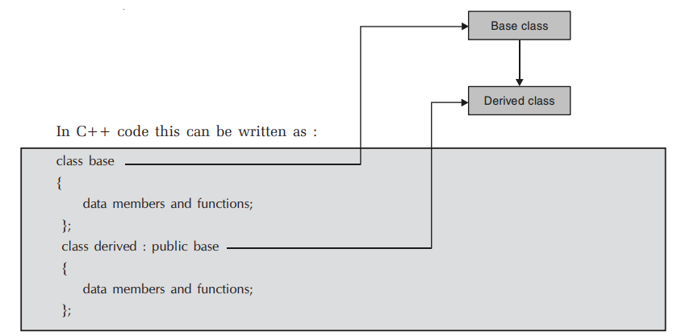
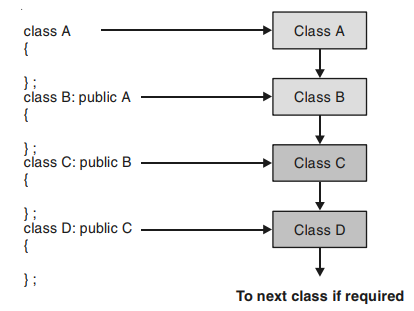
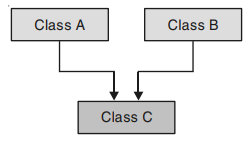
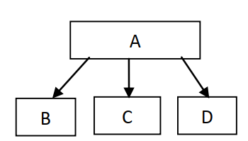
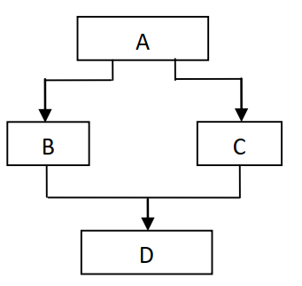

## Inheritance in C++
Reusability is yet another important feature of OOP. It is always nice if we could reuse something that already exists rather than trying to create the same all over again. It would not only save time and money but also reduce frustration and increase reliability. For instance, the reuse of a class that has already been tested, debugged and used many times can save us the effort of developing and testing the same again.

- Inheritance is the mechanism of deriving a new class from an already existing class.
- Inheritance provides the idea of reusability i.e., code once written can be used again and again in number of new classes.
- The old class is referred to as the base/super/parent class and the new one is called the derived/sub/child class.
- The derived class inherits some or all of the traits from the base class.
- A class can also inherit properties from more than one class or from more than one level.
- The new class can use all or some of the features of the already existing class and can define his own members too.
## Advantages of Inheritance
- There are some obvious cases where inheritance is needed. Consider the following cases:

- There is a need for extending the functionality of an existing class.
- There are multiple classes with some attributes common to them and problems of inconsistencies need to be avoided between the common attributes.
- The programmer would like to model a real-world hierarchy in the program in a natural way.
## Types of Inheritance
- In general inheritance is of five types:

1. Single level inheritance
2. Multilevel inheritance
3. Multiple inheritances
4. Hierarchical inheritance
5 . Hybrid Inheritance

- Again depending upon in which mode we do the above any 5 of the inheritance we can further divide inheritance as :

1. Public Inheritance
2. Private Inheritance
3. Protected Inheritance

- The syntax of deriving a new class from an already existing class is shown as :
~~~js
class new_class_name : mode old_class_name
    {
    };
~~~
- Where class is keyword used to create a class new_class_name of new derived class, mode may be private, public, or protected or even be absent i.e., be an optional.
- If mode is not present default mode private is assumed. Old_class_name is the name of an already existing class.
- It may be a user defined or a built-in class.
## Single Level Inheritance
- A derived class with only one base class, is called single inheritance. When a class extends another one class only then we  call it a single inheritance.

## Multilevel Inheritance
- In multiple inheritances we have one base class and one derived at one level. At the next level the derived class becomes base class for the next class and so on.

- The class A and B together forms one level, class B and class C together forms another level and so on.
- For a class B, class A is the parent and for class C, class B is the present thus in this inheritance level we can say that A is the grandfather of class C and class C is the grandchild of class A.
## Multiple Inheritance
- In multiple inheritance a child can have more than parent i.e., a child can inherit properties from more than one class. Diagrammatically this is as shown below :

- If a class is derived from more than one class then it is called multiple inheritance.
- Here, class C is derived from two classes, class A and class B.
## Hierarchical Inheritance
- In this type of inheritance multiple classes share the same base class. That is number of classes inherits the properties of one common base class. The derived classes again may become base class for other classes. This is shown as follows :

## Hybrid Inheritance
- It is a combination of any above inheritance types. That is either multiple or multilevel or hierarchical or any other combination.

- Here, class B and class C are derived from class A and class D is derived from class B and class C.
- class A, class B and class C is example of Hierarchical Inheritance and class B, class C and class D is example of Multiple Inheritance so this hybrid inheritance is combination of Hierarchical and Multiple Inheritance.
## Public, Private and Protected Inheritance
### Public Inheritance

- Consider the dummy code given below for inheritance.
~~~js
class B : public A
    {
    };
~~~
- The line class B : public A tells the compiler that we are inheriting class A in class B in public followings :
- All the public members of class A becomes public members of class B.
- All the protected members of class A becomes protected members of class B.
- Private members are never inherited.
### Private Inheritance

- Consider the dummy code given below for inheritance :
~~~js
class B : private A
    {
    };
~~~
- The line class B : private A tells the compiler that we are inheriting class A in class B in private mode.
- In private mode inheritance note the following points :
- All the public members of class A becomes private members of the class B.
- All the protected members of the class A becomes private members of class B.
- Private members are never inherited. The above dummy code can be written as too.
~~~js
class B : A
    {
    };
~~~
- As the default inheritance mode is private mode.
### Protected Inheritance

- Consider the dummy code given below for inheritance :
~~~js
class B : protected A
    {
    };
~~~
- The line class B : protected A tells the compiler that we are inheriting class A in class B in protected mode.
- In protected mode inheritance note the following points :
- All the public members of class A becomes protected members of class B.
- All the protected members of class A becomes protected members of class B.
- Private members are never inherited.
