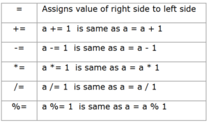
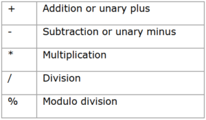
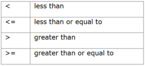
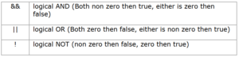
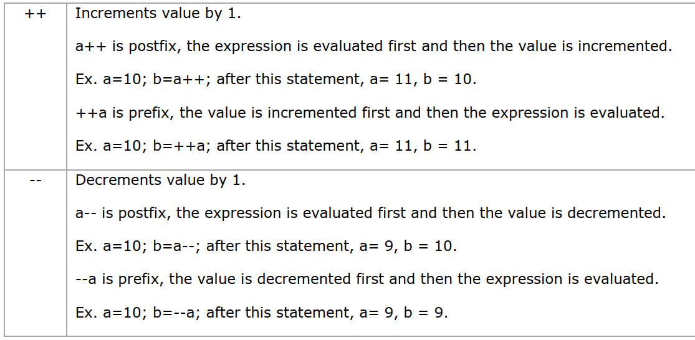
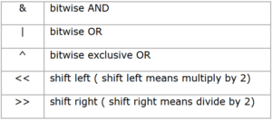

## Operators In C++
Operators are the special symbol use to perform special operation (for example, arithmetic & logical) on operands. Operands are the variables, constants or expressions on which operators perform operation.

- Operators are instructions, represented by a single symbol or combination of symbols such as +, –, /, +=, &, etc., which are used in program statements to carry out some action on the data.
- The actions may be assignment, arithmetic operations, comparison of values of two variables, determination of address of a variable, pointing to memory location or linking an object to its class member, etc.
- C++ has a rich inventory of operators.
## Assignment Operator
- Assignment operators are used to assign the result of an expression to a variable.
- C++ also supports shorthand assignment operators which simplify operation with assignment.

- The basic assignment operator is ( = ) which is often called equal to.
- On the left of this operator we write the name of variable to which a value is to be assigned or l-value and on right side we write the value to be assigned to it or r-value.
- The l-value is the memory space in which the rvalue is stored.
- Consider the following assignments.
~~~
int x = 5; // Declaration and initialization
int y = 10;
y = x ; // assignment
~~~
- In the last statement, will the value of x be assigned to y or the value of y be assigned to x?
- The associativity of = operator is right to left, so value of x will be assigned to y. In this operation y becomes 5.
## Arithmetic Operators
- Arithmetic operators are used for mathematical calculation. The  different arithmetic operators are +, –, *, / and % which represent the addition, subtraction, multiplication, division and modulus.

## Relational Operators
- Relational operators are used to compare two numbers and taking decisions based on their relation.

- Relational expressions are used in decision statements such as if, for, while, etc…
- These operators are used to compare two variables and are generally used with conditional statements.
~~~
For example, the code if(A==B) means if A and B are equal.
~~~
- Note that in this two ‘equal to’ signs (==) are used.
- Programmers often make a mistake by using single =
## Logical Operators
- Logical operators are used to test more than one condition and make decisions.

## Increment and Decrement Operators
- These are special operators in C++ which are generally not found in other languages.

## Conditional Operator
- A ternary operator is known as Conditional Operator.
- exp1?exp2:exp3 if exp1 is true then execute exp2 otherwise exp3
~~~
Ex:
x = (a>b)?a:b; which is same as
if(a>b)
x=a;
else
x=b;
~~~
## Bitwise Operators
- Bitwise operators are used to perform operation bit by bit. Bitwise operators may not be applied to float or double.

## Special Operators
- Some of the special operator are-

## Extraction operator (>>)
- Extraction operator (>>) is used with cin to input data from keyboard.
## Insertion operator (<<)
- Insertion operator (<<) is used with cout to output data from keyboard.
## Scope resolution operator (::)
- Scope resolution operator (::) is used to define the already declared member functions of the class.

Example-1: Write a C++ program to Illustrates different methods of assignments operator.
~~~js
// Write a C++ program to Illustrates different methods of assignments operator.
#include<iostream>
using namespace std;
int main()
        {
        int P(20); // This is equivalent to int P = 20;
        int M = 30;
        cout<<"P = "<<P<<",t M = "<<M<<endl;
        double C (4.56), D ; // double C(4.56) is equivalent to double C = 4.56
        D = 6.54;
        cout<< "C = "<< C<<",t D = " <<D<<endl;
        char Kh('B'); // For assigning single char the single quotes ‘ ’ are required
        char ch = 'A';
        cout << "Kh = "<< Kh << ",t ch = "<< ch <<endl;
        }
~~~
~~~
Output:
P = 20,t M = 30
C = 4.56,t D = 6.54
Kh = B,t ch = A
~~~
## Example-2: Write a C++ program to Illustrates different methods of assignments operator for string of character.
~~~js
//Write a C++ program to Illustrates different methods of assignments operator for string of character.
#include<iostream>
using namespace std;
#include<string.h>
void main()
        {
        // In following Name1, Name2 and Name3 are names of strings.
        string Name1(“Mona Lisa”); // string of characters have to be
        // put in double quotes “ “
        string Name2 = “Gyatri”;
        string Name4 = “Malhotra”;
        string Name3;
        Name3 = “Raman”; //Assignment = can be used for objects of class string.
        cout << “Name1 = “<< Name1 <<endl;
        cout << “Name2 = “ << Name2 <<endl;
        cout<< “Name3 = “<< Name3 <<endl;
        cout << “Name2 + Name4 = “ << Name2 + Name4<<endl;
        }
~~~

~~~
Output:
Name1 = Mona Lisa
Name2 = Gyatri
Name3 = Raman
Name2 + Name4 = Gyatri Malhotra
~~~
### Example-3: Write a C++ program to Illustrates the test of divisibility of integers using arithmetic operator.
~~~js
//Write a C++ program to Illustrates the test of divisibility of integers using arithmetic operator.
#include<iostream>
using namespace std;
        void main()
        {
        int A,B, m;
        cout<< “Enter two integers :”;
        cin >> A >>B;
        cout << “you have entered A = ”<<A<<"B=" <<B;
        if (A %B ) //the condition is if A%B is more than zero
        cout<<“A is not divisible by B” <<endl;
        else
        cout <<“A is divisible by B “<<endl;
        }
~~~
~~~
Output:
Enter two integers :64 2
you have entered A = 64 and B = 2
A is divisible by B
~~~
### Example-4: Write a C++ program to  Illustrates increment and decrement operators.
~~~js
//Write a C++ program to  Illustrates increment and decrement operators.
#include<iostream>
using namespace std;
int main()
        {
        int a = 6, p = 4,r=3,n =5,A,B,C,K ;
        A = 6*++n ;
        cout << “A = “<K = 5*a– – ;
        cout<<“K = “<<K<<“\t a = “ <B =r++*r++ ;
        cout<< “B = “<<B<<“\t r = “<< r << endl;
        C = p– –*p– –;
        cout<<“C= “<< C<<“\t p= “ << p << endl;
        return 0;
        }
~~~
~~~
Output:
A = 36 n = 6
K = 30 a = 5
B = 9 r = 5
C= 16 p= 2
~~~
### Example-5: Write a C++ program to  Illustrates application of increment and decrement operators.
~~~js
//Write a C++ program to  Illustrates application of increment and decrement operators.
#include<iostream>
using namespace std;
int main()
        {
        int m=6,n=2,p=4,r=3,s=8,k = 4,a,b,c,d ;
        a =++n+ ++m;
        b = s++ * s++;
        c = p– –*p– – ;
        d = (– –k* – – k)*++r ;
        cout<<“a = “<<a<<“,\tn = “<<n<<“,\tm = “<<m<<endl;
        cout<<“b = “<cout<<“c = “<<c<<“,\tp = “<<p<<endl;
        cout<<“d = “<return 0;
        }
~~~
~~~
Output:
a = 10, n = 3, m = 7
b = 64, s = 10
c = 16, p = 2
d = 16, k = 2, r = 4
~~~

### Example-6: Write a C++ program to  Illustrates the application of Boolean operators.
~~~js
//Write a C++ program to  Illustrates the application of Boolean operators.
#include<iostream>
using namespace std;
        int main()
        {
        int p, q, r, s,t,x, y, z;
        p =1;
        q = 0;
        r = 1;
        s = p||q;
        t = !q;
        x = p&&q;
        y = (p || q && r||s);
        z = (!p || !q && !r || s);
        cout << “s = ”<cout << “y = ” <return 0;
        }
~~~
~~~
Output:
s = 1, t = 1, x = 0
y = 1, z = 1
~~~
### Example-7: Write a C++ program to Illustrates bitwise AND operator.
~~~js
//Write a C++ program to Illustrates bitwise AND operator.
#include<iostream>
using namespace std;
void main()
        {
        short A =24;
        short B = 8;
        int C = A&B;
        cout << “C = “<<;
        }
~~~
~~~
Output:
C = 8
~~~