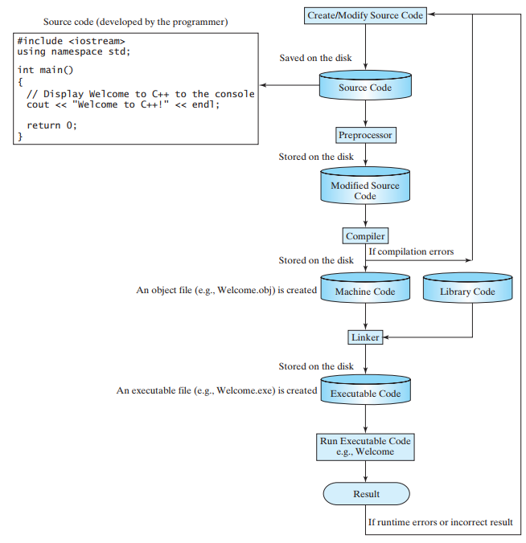

## C++ Program Development Cycle
The C++ compiler command performs three tasks in sequence: preprocessing, compiling, and linking. Precisely, a C++ compiler contains three separate programs are preprocessor, compiler, and linker. For simplicity, we refer to all three programs together as a C++ compiler.

## Preprocessor
- A preprocessor is a program that processes a source file before it is passed down to the compiler.
- The preprocessor processes the directives. The directives start with the # sign. For example, #include  is a directive to tell the compiler to include a library.
- The preprocessor produces an intermediate file.
## Compiler
- The compiler then translates the intermediate file into a machine-code file.
- The machine-code file is also known as an object file.
## Linker
- The linker links the machine-code file with supporting library files to form an executable file.
- On Windows, the machine-code file is stored on disk with an .obj extension, and the executable files are stored with an .exe extension.
- On UNIX, the machine code file has an .o extension and the executable files do not have file extensions.
A C++ source file typically ends with the extension .cpp. Some compilers may accept other file name extensions (e.g., .c, .cp, or .c), but you should stick with the .cpp extension to be compliant with all C++ compilers. The C++ program-development process consists of creating/modifying source code, compiling, linking and executing programs shown below-.

- C++ program CycleC++ program can be develop from a command window or from an IDE.

- An IDE is software that provides an integrated development environment (IDE) for rapidly developing C++ programs.
- Editing, compiling, building, debugging, and online help are integrated in one graphical user interface.
- Just enter source code or open an existing file in a window, then click a button, menu item, or function key to compile and run the program.
- Examples of popular IDEs are Microsoft Visual C++, Dev-C++, Eclipse, and NetBeans. All these IDEs can be downloaded free.

