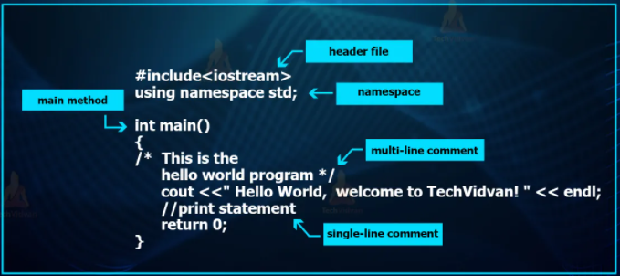

## Structure of C++ Program
Every C++ program is made of several sections, and each section is made of several parts. Each section or part must follow the rules defined in the C++ language, just as documents written in one of the natural languages follow the rules of that language. Probably the best way to start learning a programming language is by writing a program. Let us begin with a simple example of a C++ program that prints a string on the screen.

~~~js
//my first program in C++
#include<iostream>
using namespace std;
int main ()
    {
    cout << "Hello World!";
    return 0;
    }
~~~
~~~
Output:
Hello World!
~~~
It is one of the simplest programs that can be written in C++, but it already contains the fundamental components that every C++ program has. We are going to look line by line at the code we have just written:

## // my first program in C++
- This is a comment line. All lines beginning with two slash signs (//) are considered comments and do not have any effect on the behavior of the program.
- The programmer can use them to include short explanations or observations within the source code itself.
- In this case, the line is a brief description of what our program is.
## #include
- Lines beginning with a hash sign (#) are directives for the preprocessor.
- They are not regular code lines with expressions but indications for the compiler’s preprocessor.
- In this case the directive #include tells the preprocessor to include the iostream standard file.
- This specific file (iostream) includes the declarations of the basic standard input-output library in C++, and it is included because its functionality is going to be used later in the program.
## using namespace std;
- All the elements of the standard C++ library are declared within what is called a namespace, the namespace with the name std.
- So in order to access its functionality we declare with this expression that we will be using these entities.
- This line is very frequent in C++ programs that use the standard library, and in fact it will be included in most of the source codes.
## int main ()
- This line corresponds to the beginning of the definition of the main function. The main function is the point by where all C++ programs start their execution, independently of its location within the source code.
- It does not matter whether there are other functions with other names defined before or after it – the instructions contained within this function’s definition will always be the first ones to be executed in any C++ program.
- The word main is followed in the code by a pair of parentheses (()). That is because it is a function declaration.
- Right after these parentheses we can find the body of the main function enclosed in braces ({}). What is contained within these braces is what the function does when it is executed.
## cout << "Hello World!";
- This line is a C++ statement. A statement is a simple or
- compound expression that can actually produce some effect.
- In fact, this statement performs the only action that generates a visible effect in our first program.
- cout is declared in the iostream standard file within the std namespace.
- Notice that the statement ends with a semicolon character (;).
- This character is used to mark the end of the statement and in fact it must be included at the end of all expression statements in all C++ programs.
## return 0;
- The return statement causes the main function to finish. return may be followed by a return code (in our example is followed by the return code 0).
- A return code of 0 for the main function is generally interpreted as the program worked as expected without any errors during its execution.
- This is the most usual way to end a C++ console program.
## Important Note
- All the lines of this program did not perform actions when the code is executed.
- There were lines containing only comments (those beginning by //).
- There were lines with directives for the compiler’s preprocessor (those beginning by #).
- Then there were lines that began the declaration of a function (in this case, the main function) and, finally lines with statements (like the insertion into cout), which were all included within the block delimited by the braces ({}) of the main function. For example-
~~~js
int main ()
    {
    cout << " Hello World!";
    return 0;
    }
~~~
We could have written:
~~~js
int main () { cout << "Hello World!"; return 0; }
~~~
- In C++, the separation between statements is specified with an ending semicolon (;) at the end of each one, so the separation in different code lines does not matter at all for this purpose.
- We can write many statements per line or write a single statement that takes many code lines.
- The division of code in different lines serves only to make it more legible and schematic for the humans that may read it.
- Preprocessor directives (those that begin by #) are out of this general rule since they are not statements.
- They are lines read and processed by the preprocessor and do not produce any code by themselves.
- Preprocessor directives must be specified in their own line and do not have to end with a semicolon (;). Consider the following example-

### Example-1: Write a C++ program to print “Welcome to C++!”.
~~~js
//Write a C++ program to print "Welcome to C++!".
#include<iostream>
using namespace std;
int main()
    {
    // Display Welcome to C++ to the console
    cout << "Welcome to C++!" << endl;
    return 0;
    }
~~~
~~~
Output: Welcome to C++!
~~~
### Example-2: Write a C++ program to print three message in separate line.
~~~js
//Write a C++ program to print three message in separate line.
#include<iostream>
using namespace std;
int main()
    {
    cout << "Programming is fun!" << endl;
    cout << "Fundamentals First" << endl;
    cout << "Problem Driven" << endl;
    return 0;
    }
~~~
~~~
Output:
Programming is fun!
Fundamentals First
Problem Driven
~~~
### Example-3: Write a C++ program to print a simple mathematical expression.
~~~js
//Write a C++ program to print a simple mathematical expression.
#include<iostream>
using namespace std;
int main()
    {
    cout << "(10.5 + 2 * 3) / (45 - 3.5) = ";
    cout << (10.5 + 2 * 3) / (45 - 3.5) << endl;
    return 0;
    }
~~~
~~~
Output:
(10.5 + 2 * 3) / (45 – 3.5) = 0.39759036144578314
~~~