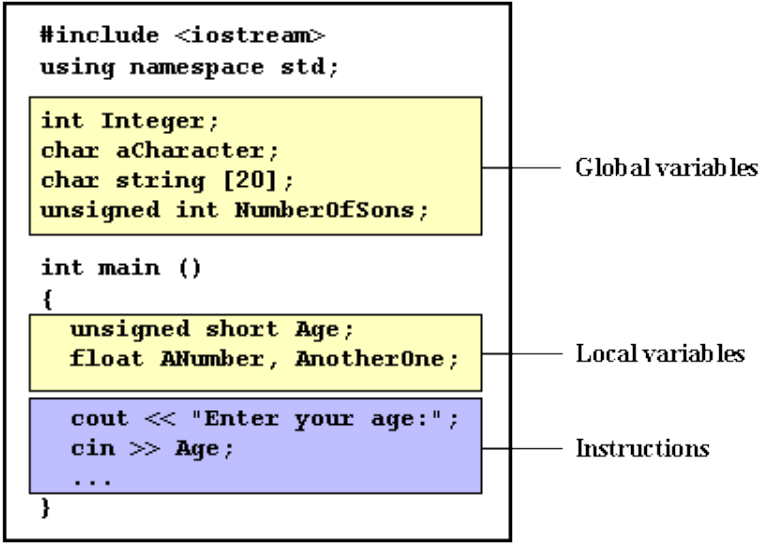

## Variable in C++
Programs written in the C++ language receive input data, manipulate them, and create output data. Since the input and output data may change, we must be able to store the input data, store the intermediate data, and store the output data in memory. For this reason, C++, like most programming languages, uses the concept of variables.

- A variable in computer language is a memory chunk that needs to have a name and a type.
- A variable is a memory location, with a name and a type, that stores different values in each moment of a program’s execution.
- It is called a variable because its contents may change during the execution of the program.
- It’s purpose is to store and retrieve data.
- It must have a type because we use different data types for different purposes.
## Variable Declaration
- A variable must be defined before you can use it in a program. When you define a variable the type is specified and an appropriate amount of memory reserved.
- This memory space is addressed by reference to the name of the variable.
- The syntax to declare a new variable is to write the specifier of the desired data type (like int, bool, float…) followed by a valid variable identifier.
- A simple definition has the following syntax:
   - dataType name1, name2, name3.....;
- Example
~~~
int a;
float mynumber;
int a, b, c;
~~~
- These are two valid declarations of variables. The first one declares a variable of type int with the identifier a.
- The second one declares a variable of type float with the identifier mynumber.
- Once declared, the variables a and mynumber can be used within the rest of their scope in the program.
- Thus, one or more variables can be stated within a single definition.
- Variables can be defined either within the program’s functions or outside of them.
- A variable defined outside of each function is global, i.e. it can be used by all function
- A variable defined within a function is local, i.e. it can be used only in that function.
- Local variables are normally defined immediately after the first brace—for example at the beginning of a function.
- However, they can be defined wherever a statement is permitted.
- This means that variables can be defined immediately before they are used by the program.
## Variable Initialization
- A variable can be initialized, i.e. a value can be assigned to the variable, during its definition.
- Initialization is achieved by placing the following immediately after the name of the variable.
~~~
int a=100;
float b=10.50;
char c='a';
~~~
- Any global variables not explicitly initialized default to zero.
- In contrast, the initial value for any local variables that you fail to initialize will have an undefined initial value.
## Scope of variables
- All the variables that we intend to use in a program must have been declared with its type specifier in an earlier point in the code.
- A variable can be either of global or local scope.
- A global variable is a variable declared in the main body of the source code, outside all functions, while a local variable is one declared within the body of a function or a block.

- Global variables can be referred from anywhere in the code, even inside functions, whenever it is after its declaration.
- The scope of local variables is limited to the block enclosed in braces ({}) where they are declared.
- For example, if they are declared at the beginning of the body of a function (like in function main) their scope is between its declaration point and the end of that function.
- In the example above, this means that if another function existed in addition to main, the local variables declared in main could not be accessed from the other function and vice versa.
### Example-1: Write a C++ program to illustrate variable declaration and initialization.
~~~js
// Write a C++ program to illustrate variable declaration and initialization.
#include<iostram>
using namespace std;
int main ()
    {
    int a=5; //initial value = 5
    int b(2); // initial value = 2
    int result; // initial value undetermined
    a = a + 3;
    result = a - b;
    cout << result;
    return 0;
}
~~~
~~~
Output:
6
~~~
### Example-2: Write a C++ program to gets the values for two numbers from the keyboard and adds them together and prints the result on the monitor.
~~~js
//Write a C++ program to gets the values for two numbers from the keyboard and adds them together and prints the result on the monitor.
#include<iostream>
using namespace std;
int main ()
    {
    // Definition
    int num1;
    int num2;
    int sum;
    // Getting inputs
    cout << "Enter the first number: "; cin >> num1;
    cout << "Enter the second number: "; cin >> num2;
    // Calculation and storing result
    sum = num1 + num2;
    // Display output
    cout << "The sum is: " << sum;
    return 0;
    }
~~~
~~~
Output-1:
Enter the first number: 23
Enter the second number: 35
The sum is: 58
Output-2:
Enter the first number: 7
Enter the second number: 110
The sum is: 117
~~~
